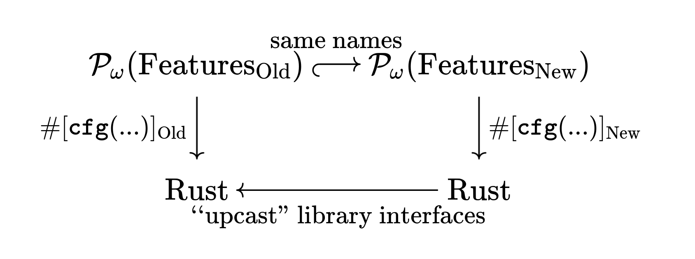

- Feature Name: `at-least-one-feature`
- Start Date: 2022-11-11
- RFC PR: [rust-lang/rfcs#0000](https://github.com/rust-lang/rfcs/pull/0000)
- Rust Issue: [rust-lang/rust#0000](https://github.com/rust-lang/rust/issues/0000)

# Summary
[summary]: #summary

Allow packages to require that dependencies on them must specify at least one feature (the `default` feature counts).
This avoids backwards compatibility problems with `default-features = false`.

# Motivation
[motivation]: #motivation

A major use-case of Cargo features to take previously mandatory functionality and make it optional.
This is usual done in order to make the code more portable than it was previously, while not breaking existing consumers of the library.
Consider this example which shoes both work works and what doesn't:

1. Library has no features.

2. A `foo` feature is added, gating functionality that already existed.
   It is on by default.
   `no-default-features = true` can be used in which some dependencies only needed for `foo` can be avoided.
   Yay!

3. A `bar` feature is added, gating functionality that already existed.

   - Suppose it is off by default.
     Oh no!
     All Existing use-cases break because the functionality that depends on `bar` goes away.

   - Suppose it is on by default, or depended-upon by `bar`.
     Oh no!
     Existing `no-default-features = true` are now broken!
     They want a feature set of `{bar}` which would correspond to the old `{}`, but there is no way to arrange it.

In step two, we could "ret-con" the empty feature set with the `default` feature.
But this is a trick that can only be pulled once.
The second time around, we already have a default feature; we are out of luck.

The previous attempts attempted to make new default features, or migrate the requested feature sets.
But that is complex.
There is exactly a simpler solution: simply require that *some* feature always be depended-upon.

To see why this works, it helps to first see that step 2 was *already* broken.
Here's the thing, even though there previously were not any features, that *doesn't* mean there were not any `no-default-features = true` users!
Sure, it wouldn't do anything for crate with new features, but one can still use it.
Then when just `bar` is added, we already have a problem, because the `default` feature will no "catch" all the existing users ---
the mischievous users that were already using `no-default-features = true` will have their code broken!

This brings us to the heart of the problem.
So long as users are depending on "something", we can be careful to make sure those features keep their meaning.
But when users are depending on nothing at all with `no-default-features = true` and an empty feature set, we have nothing to "hook into".
The simple solution is just to rule out that problem entirely!

# Guide-level explanation
[guide-level-explanation]: #guide-level-explanation

Packages with
```toml
[package]
at-least-one-feature = true
```
are easier to maintain!
You don't need to worry about the `no-default-features = true, features = []` case anymore.
You can be sure that all consumers must dependent on either `default` or a regular named feature.

Whenever you want to make existing functionality more conditional, simply extend the set of features the code relies on with a new feature, and ensure existing features depend on that feature.

For example:
```rust
fn my_fun_that_allocates() { .. }

#[cfg(all(feature = "foo", feature = "bar"))]
fn my_weird_fun_that_allocates() { .. }
```
becomes:
```rust
#[cfg(feature = "baz")]
fn my_fun_that_allocates() { .. }

#[cfg(all(feature = "foo", feature = "bar", feature = "baz"))]
fn my_weird_fun_that_allocates() { .. }
```

And the corresponding `Cargo.toml`:
```toml
[features]
default = ["foo"]
bar = ["foo"]
```
becomes:
```toml
[features]
default = ["foo", "baz"]
foo = ["baz"]
bar = ["foo"] # no need to add "baz" because "bar" picks it up
```

# Reference-level explanation
[reference-level-explanation]: #reference-level-explanation

Depending on a
```toml
[package]
at-least-one-feature = true
```
crate with an empty feature set is disallowed and invalidates the solution.
The `default` feature counts as a member of that set when `default-features = true`.

The solver shall avoid such solutions (so as not break old versions of libraries without `at-least-one-feature` being "discoverable").

## Provisional Theory

We can begin to formalize library compatibility with something like this
[commutative diagram](https://en.wikipedia.org/wiki/Commutative_diagram):

[(generated from here)](https://q.uiver.app/?q=WzAsNCxbMCwwLCJcXG1hdGhjYWx7UF/PiX0oXFxtYXRocm17RmVhdHVyZXN9X3tcXG1hdGhybXtPbGR9fSkiXSxbMSwwLCJcXG1hdGhjYWx7UF/PiX0oXFxtYXRocm17RmVhdHVyZXN9X3tcXG1hdGhybXtOZXd9fSkiXSxbMCwxLCJcXG1hdGhybXtSdXN0fSJdLFsxLDEsIlxcbWF0aHJte1J1c3R9Il0sWzAsMSwiXFxtYXRocm17c2FtZVxcIG5hbWVzfSIsMCx7InN0eWxlIjp7InRhaWwiOnsibmFtZSI6Imhvb2siLCJzaWRlIjoiYm90dG9tIn19fV0sWzAsMiwiXFwjW1xcbWF0aHR0e2NmZ30oLi4uKV1fXFxtYXRocm17T2xkfSIsMl0sWzEsMywiXFwjW1xcbWF0aHR0e2NmZ30oLi4uKV1fXFxtYXRocm17TmV3fSJdLFszLDIsIlxcbWF0aHJte2BgdXBjYXN0XCJcXCBsaWJyYXJ5XFwgaW50ZXJmYWNlc30iXV0=)

- The old and new features form a partial order

- P_ω takes those partial orders to the partial order of their downsets.
  (That is, sets of features with the implied features from feature dependencies "filled in", ordered by inclusion.)

- "same names" maps the old downsets to the new downsets, filling in any newly implied features as needed.

- `#[cfg(...)]` is the mapping of feature sets to exposed library interfaces

- "'upcast' library interfaces" forgets whatever unrelated new stuff was added in the new library version

The idea is that going from the old features directly to the old interfaces, or going the "long way" from old features to new features to new interfaces to old interfaces should yield the same result.

For the more part, features can be "interspersed" anywhere the old feature partial order to make the new feature partial order.
However, this is an exception!
The old empty downset becomes the new empty downset, which means nothing can be added below it.
This is the `default-features = false` gotcha!

When we disallow the empty feature set, we are replacing P_ω with the "free join-semilattice" construction.
We are enriching features with the ∨ binary operator but no ⊥ identity element.
There is no empty downset becomes empty downset constraint, and thus we are free to add new features below all the others all we want.

# Compatibility of `at-least-one-feature = true` itself

At first, it seems like adding `at-least-one-feature = true` to a new version of a crate is a breaking change.
But, I don't think it is.
We have to step back a bit: a breaking change is one that if it *didn't* come with an increasing major version, would result in valid Cargo plans that do not build.
Yes, adding `at-least-one-feature = true` to a newer version of a crate will result in depending (not dependent) crate that do not specify a feature for that dependency being unable to upgrade.
But that's it!
Those crates will *not* have their dependencies upgraded incorrectly, resulting in a build failure, and thus there is no problem.

(This is very much analogous to the situation with minimum Rust versions.
Updating the minimum Rust version in a new version of a crate is not a breaking change.
Some users with old versions will be unable to use the new version, but no one will be falsely upgraded resulting in a build failure.

Indeed, that point of being able to express the minimum Rust version is precisely to *avoid* bumping the minimum supported version being a breaking change.
Before, Cargo was unaware of this dependency on the compiler, and so raising the implicit lower bound had to be a breaking change.
Now, Cargo is aware of the dependency and it is no longer a breaking change.

Putting it altogether, in general we can say that bumping major versions is a tool of last result to account for issues Cargo can't directly know about.
If Cargo can be directly made aware of the issue, then there is no "residual breakage" requiring a major version bump.)

# Drawbacks
[drawbacks]: #drawbacks

## Bad names over time

A downside of this proposal is that one has to resort to increasingly bad names.
Take [seanmonstar/warp#968](https://github.com/seanmonstar/warp/issues/968) as an example.
Warp currently ships HTTP2 support by default. This means that in order to be able to ship a version without http2, _all current features must depend on HTTP2_.
This means creating new `websocket-without-http2`, `tls-without-http2`, `compression-without-http2`, `compression-brotli-without-http2`, `compression-gzip-without-http2` features in order for other crates to depend on them without pulling in http2 support.

Note that this is only a problem for new features that existing features or orthogonal too.
In many cases, existing features will naturally (not just for back compat) depend on the new features, and then there is no need or possibility to introduce `...-without-...` siblings to those features.

My sense that while that is a downside, it is better to first walk that run.
Do this and the problem is solved.
We can add feature migrations later once there is more demand.
See the Alternatives section for more details.

# Rationale and alternatives
[rationale-and-alternatives]: #rationale-and-alternatives

## Empty feature set is empty library.

An alternative is not to ban the empty feature set, but ensure it always translates to the empty library.
I.e. to require that *all* items must be dependent upon *some* feature; everything needs a `cfg`.

Returning to our half-worked-out theory, instead of banning a notion of a ⊥ empty feature set that must be preserved from the old library to the new (removing a requirement), we are adding a *new* requirement that the ⊥ feature set must map to the ⊥ Rust interface.
We still have the restriction that new features can be added below, but this restriction is no longer a problem:
there is no point of adding such a new minimal feature because there is nothing left to `cfg`-out!

This solution is more mathematically elegant, but it seems harder to implement.
It is unclear how Cargo could require the Rust code to obey this property without new infra like the portability lint.

Finally, in a sense these variations are actually isomorphic.
If no one can request the empty feature set, no one can observe what library interface that corresponds to.
There is no reason to conclude that it *isn't* the empty library.

## RFC [#3146](https://github.com/rust-lang/rfcs/pull/3146)

This more more expensive solution aimed to solve the "running out of good names" problem this has.

Returning to our commutative diagram, instead of

- removing the ⊥ feature downset (this proposal)

- mandating the ⊥ feature downset correspond to ⊥ the empty library interface (first alternative, extra rules on the vertical mappings in diagrams)

We can instead

- allow customizing the mapping from old feature names to new feature names (customizing top horizontal mapping)

This works and allows giving things the "right" names" every time, but is much work work to implement.

I think it might make sense to do this someday, but it is better to start with this.
My thinking about this is basically "walk before run".
Today, that would be lots of work for an obscure problem, and a solution that downstream crates need to know about because it affects how dependencies are written.
However if we do this first, "opt-out features" are poised to become much more popular now that they are no longer a compatibility hazard.
We can evaluate both that new popularity, and the incidence of the "bad name" problem in *practice*, and use that to justify a more heavyweight solutions.

## RFC [#3283](https://github.com/rust-lang/rfcs/pull/3283)

This proposal adds a new notion of a "feature base", which aims to essential provide more `default-features = false` options rather than just one forever.
`default-features = false` is ret-conned as the first feature base.

My view is that that RFC is pretty close to being this one in disguise.
A "feature base" is just a feature.
The fact that there is always one "feature base" is just another way of accomplishing the "at least one feature"
restriction.

The main difference is that `default-features = false` is ret-conned as a feature to allow for existing users.
That can be thought of from the perspective of this RFC as a "one-off" feature migration to get reverse dependencies predating the use of `at-least-one-feature = true` on to a feature so they retroactively abide by the "at least one feature" rule.

## "Negative features"

I take a pretty dim view of this.
It is easy to say that one wants negative features; it is harder to actually give a proper semantics for them.
As far as I know, additive features are the only reasonable core semantics, so we have no choice but to "pre-process" away negative features before they ruin our core model.

Here is an example of such a pre-processing step.
Recall from our preliminary theory section that feature sets are feature *downsets*.
Whatever the user writes, we must complete it with the missing features implied by what they wrote.
That means we have this process:

> Syntactic feature set
>
> --- fill in missing features --->
>
> Semantic feature downset

We can add a middle step to account for "negative features"

> Syntactic feature "dual set"
>
> --- negate negative features: add if they were not included, remove if they were --->
>
> Strictly positive feature set
>
> --- fill in missing features --->
>
> Semantic feature downset

But not the ramifications of this: the final "fill in missing features" step may well "add back" one of the features that was removed!

I think this will be confusing to users, to say the least.
Moreover it is crucial to understand the underlying additive feature model to become proficient with Cargo, and the more we "disguise" it with superficial negative features, the harder it will be for users to understand that model.
The syntax *impedes* learning.

I think this is an awkward middle ground between this (dirt easy) and full feature migrations.
Only full feature migrations provide the "ideal" naming of feature so users new to a library can be blissfully ignorant of whatever features previous versions of the library supported.

# Prior art
[prior-art]: #prior-art

Nothing direct to my knowledge.
In Haskell we often implement a lot of "non-empty" data structures because their sneaky semantics are useful.
So in some sense the Math is newly-applied here, but not newly applied to programming in general.

# Unresolved questions
[unresolved-questions]: #unresolved-questions

It would be nice to completely work out the theory.

# Future possibilities
[future-possibilities]: #future-possibilities

The `default-features = false` syntax is clunky.
A new edition could say that an explicit feature list always means `default-features = []`, but that `default` can be used in feature lists.
With this change, "must depend on one feature, including possibly the default feature" becomes easier to explain:

- `[]` disallowed
- `["default"]` allowed
- `["foo"]` allowed
