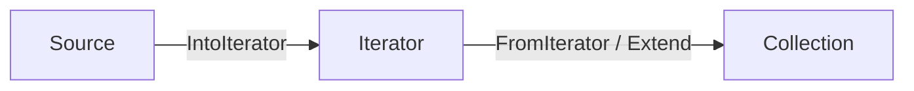
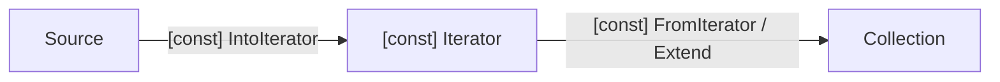

- Feature Name: `const_fromiter`
- Start Date: 2026-08-13
- RFC PR: [rust-lang/rfcs#0000](https://github.com/rust-lang/rfcs/pull/0000)
- Rust Issue: [rust-lang/rust#0000](https://github.com/rust-lang/rust/issues/0000)

## Summary
[summary]: #summary

This feature aims to allow the `FromIterator` and `Extend` traits to be evaluated in the CTFE by making them const traits.

It does not try to constify current implementations of the trait.

## Motivation
[motivation]: #motivation

The feature [`const_iter`](https://github.com/rust-lang/rust/issues/92476) already introduced compile-time evaluation for the traits `Iterator`, `IntoIterator` and `DoubleEndedIterator`.

We can have a certain collection on a const-context and:
- Convert it to an iterator with `const IntoIterator`,
- Consume the iterator with `const Iterator`,
- Insert elements with a const-evaluable insertion function.

But we can't:
- Extend the collection: we would instead manually unfold the iterator with a manual loop,
- Nor create a new collection from the constant iterator.

| Trait | Const-support |
|:------|:---------------|
| `DoubleEndedIterator` | Unstable |
| `ExactSizeIterator` | None |
| `Iterator` | Unstable |
| `FromIterator` | None |
| `IntoIterator` | Unstable |
| `Extend` | None |

The natural progression to make iterator-adjacent traits const involves switching `FromIterator` and `Extend`.

This advances the Rust 2026 goal of [improving support for const traits.](https://rust-lang.github.io/goals/2026/const-traits.html)

## Guide-level explanation
[guide-level-explanation]: #guide-level-explanation

The `Extend` and `FromIterator` traits are now const-compatible. The bound underlying each is that in order to extend/create a collection at compile-time from a source, that source has to be converted into an iterator and the iterator has to be consumed whilst allowing the resulting iterator to be destructed once it falls out of scope in a const-context.

Old workflow:



New workflow:



### Example 1

Suppose we have a maximally-sized array stored on the stack with constant operations, and we want extend to be const-compatible as well.

```rust
#![allow(incomplete_features)]

#![feature(const_trait_impl)]
#![feature(const_destruct)]
#![feature(generic_const_exprs)]
#![feature(const_iter)]
#![feature(const_default)]

use core::mem::MaybeUninit;
use core::marker::Destruct;

pub struct Array<Type, const N: usize> {
    length: usize,
    data: [MaybeUninit<Type>; N]
}

impl<Type, const N: usize> Array<Type, N> {
    pub const fn push(&mut self, value: Type) -> () {
        self.push_mut(value);
    }
    pub const fn push_mut<'valid>(&'valid mut self, value: Type) -> &'valid mut Type {
        let reference = self.data[self.length].write(value);
        self.length += 1;
        return reference;
    }
}

//> ARRAY -> DEFAULT
const impl<Type, const N: usize> Default for Array<Type, N> {
    fn default() -> Self {return Self {
        data: MaybeUninit::uninit().transpose(),
        length: 0
    }}
}

// then extend isn't
//
//impl<Type, const N: usize> Extend<Type> for Array<Type, N> {
//    fn extend<T: IntoIterator<Item = Type>>(&mut self, iter: T) {
//        iter.into_iter().for_each(|item| self.push(item));
//    }
//}

// it is:
const impl<Type, const N: usize> Extend<Type> for Array<Type, N> {
    fn extend<
        T: [const] IntoIterator<IntoIter: [const] Iterator<Item = Type> + [const] Destruct>
    >(&mut self, iter: T) {
        for element in iter {
            self.push(element);
        }
    }
}

// so we can now do
static MYARRAY: Array<usize, 5> = const {
    let mut array = Array::default();
    array.push(1);
    array.extend([1, 2, 3]);
    array
}
```

### Example 2

Suppose we want an custom struct that ingests sequences of numbers and stores the sum, the count, and the last one (if any).

```rust
#![feature(const_trait_impl)]
#![feature(const_iter)]
#![feature(const_destruct)]
#![feature(const_default)]
#![feature(derive_const)]

use core::marker::Destruct;

#[derive_const(Default)]
struct Saver {
    sum: usize,
    count: usize,
    last: Option<usize>
}

const impl Extend<usize> for Saver {
    fn extend<
        T: [const] IntoIterator<IntoIter: [const] Iterator<Item = usize> + [const] Destruct>
    >(&mut self, iter: T) {
        for number in iter {
            self.count += 1;
            self.sum += number;
            self.last = Some(number);
        }
    }
}

const impl FromIterator<usize> for Saver {
    fn from_iter<
        T: [const] IntoIterator<IntoIter: [const] Iterator<Item = usize> + [const] Destruct>
    >(iter: T) -> Self {
        let mut instance = Self::default();
        instance.extend(iter);
        return instance;
    }
}

const SAVED: Saver = const {
    let mut new = Saver::from_iter([1, 2, 3]);
    new.extend([0, 0, 0, 4, 5, 6]);
    new
}
```

## Reference-level explanation
[reference-level-explanation]: #reference-level-explanation

### `Extend` API

The current API:

```rust
#[stable(feature = "rust1", since = "1.0.0")]
pub trait Extend<A> {
    #[stable(feature = "rust1", since = "1.0.0")]
    fn extend<T: IntoIterator<Item = A>>(&mut self, iter: T);

    // ... existing methods which are unaffected

}
```

changes to:

```rust
#[stable(feature = "rust1", since = "1.0.0")]
#[rustc_const_unstable(feature = "const_fromiter", issue = "none")] // none yet
pub const trait Extend<A> {
    #[stable(feature = "rust1", since = "1.0.0")]
    fn extend<
        T: [const] IntoIterator<IntoIter: [const] Iterator<Item = A> + [const] Destruct>
    >(&mut self, iter: T);

    // ... existing methods which are unaffected

}
```

### `FromIterator` API

The current API:

```rust
#[stable(feature = "rust1", since = "1.0.0")]
pub trait FromIterator<A>: Sized {
    #[stable(feature = "rust1", since = "1.0.0")]
    fn from_iter<T: IntoIterator<Item = A>>(iter: T) -> Self;
}
```

changes to:

```rust
#[stable(feature = "rust1", since = "1.0.0")]
#[rustc_const_unstable(feature = "const_fromiter", issue = "none")] // none yet
pub const trait FromIterator<A>: Sized {
    #[stable(feature = "rust1", since = "1.0.0")]
    fn from_iter<
        T: [const] IntoIterator<IntoIter: [const] Iterator<Item = A> + [const] Destruct>
    >(iter: T) -> Self;
}
```

## Drawbacks
[drawbacks]: #drawbacks

It complicates the public API substantially.

This feature complies with the [current policy for constifying traits, ](https://github.com/rust-lang/rust/issues/155816) which specifically mentions work on const iterators.

## Rationale and alternatives
[rationale-and-alternatives]: #rationale-and-alternatives

The design selected requires the trait bound `T: [const] IntoIterator<IntoIter: [const] Iterator<Item = A> + [const] Destruct>` for `extend` and `from_iter`.

Other designs considered were:
- `T: [const] IntoIterator<Item = A, IntoIter: [const] Iterator + [const] Destruct>`: which is essentially the same given how `IntoIterator` and `Iterator` are defined but omits the `Item` associated type on `IntoIter`,
- `T: [const] IntoIterator<Item = A, IntoIter: [const] Iterator<Item = A> + [const] Destruct>`: which is redundant by specifying twice that the `Item = A`.

The design chosen is the most syntactically clear.

The `[const] Destruct` bound on `IntoIter` is required because the iterator has to be cleaned up at the end of the function scope.

## Prior art
[prior-art]: #prior-art

Mentioned issues and features.

## Unresolved questions
[unresolved-questions]: #unresolved-questions

- Whether there are any collections on the `core`/`std` library that would benefit from making its implementation const

## Future possibilities
[future-possibilities]: #future-possibilities

The most immediate possibility is to make the `collect` method on iterator const-compatible as well.

Some heap-allocated collections in the standard library and on crates.io might be eligible to use `const Extend` and `const FromIterator` via [`const_heap`](https://github.com/rust-lang/rust/issues/79597) since some implementations rely on simply appending/pushing/inserting each of the values from the iterator.

Otherwise, stack-allocated collections may make use of the constified version of the trait if their algorithm relies on repeated const-compatible insertion.