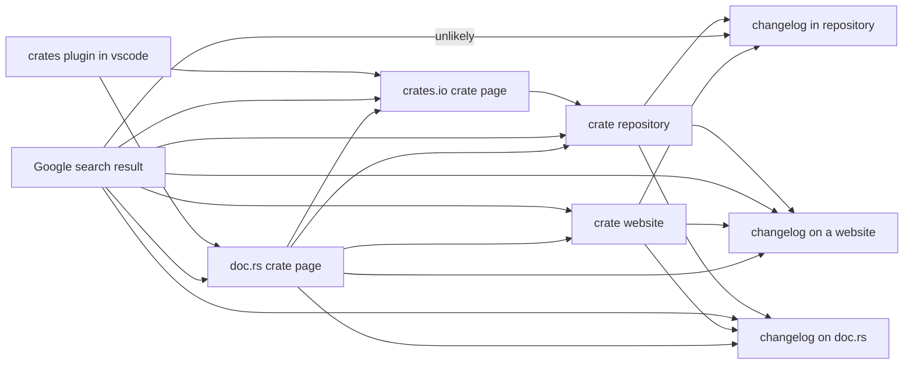

- Feature Name: crate-changelog-field
- Start Date: 2025-02-25
- RFC PR: (leave this empty)
- Rust Issue: (leave this empty)

# Summary
[summary]: #summary

Add changelog support to `cargo`, [crates.io](https://crates.io/) and [doc.rs](https://doc.rs/).

# Motivation
[motivation]: #motivation

Citing [keepachangelog.com](http://keepachangelog.com):

> What is a changelog?
>
>  A changelog is a file which contains a curated, chronologically ordered list of notable changes for each version of a project.
>
> Why keep a changelog?
>
> To make it easier for users and contributors to see precisely what notable changes have been made between each release (or version) of the project.
>
> Who needs a changelog?
>
> People do. Whether consumers or developers, the end users of software are
> human beings who care about what's in the software. When the software changes,
> people want to know why and how.

Encouraging crate authors to keep changelogs and increase its visibility for
crate users will definitely benefit crates ecosystem.

From a consumer's perspective, this feature could make the discovery of the changelog much easier.
For instance, the "crates" plugin could leaverage this field to show a link to
the changelog when a user hovers on a dependency in `Cargo.toml`.


Current situation: a consumer usually needs to jump through several hops to find the changelog:



This topic was brought several times, most notable notions are:

- [Previously closed RFC](https://github.com/rust-lang/rfcs/pull/2129)
- [Rustaceans: Please Keep a Changelog!](https://blog.dbrgn.ch/2015/12/1/rust-crates-keep-a-changelog/) ([reddit](https://www.reddit.com/r/rust/comments/3v1ndl/))
- [Cargo issue](https://github.com/rust-lang/cargo/issues/2188)
- [Reddit thread](https://www.reddit.com/r/rust/comments/6vvhjh/)

# Guide-level explanation
[guide-level-explanation]: #guide-level-explanation

An optional `changelog` field is available, which is currently in the format
of a URL to an external resource.

Examples:

```toml
[package]
name = "foo"
version = "0.1.0"
changelog = "https://github.com/foo-org/foo/releases"
```

```toml
[package]
name = "bar"
version = "1.0.0"
changelog = "https://github.com/bar-org/bar/blob/main/CHANGELOG.md"
```

For crates with `changelog` field, crates.io and docs.rs show a link to the
changelog in the corresponding page of the crate.

# Reference-level explanation
[reference-level-explanation]: #reference-level-explanation

## Cargo

A new `changelog` field will be added to crate manifest,
which only accepts valid URL for now.
However, it is explicitly stated that in the future the field could be
extended to handle other formats than URL and such a change is not considered
breaking.
So external tools should expect that the field could contain contents that are
not valid URL and handle it with caution.

For a cargo workspace, it is possible for several crates to share a changelog
via the usage of `changelog.workspace`, just like
[`documentation.workspace`](https://doc.rust-lang.org/cargo/reference/workspaces.html#the-package-table).

For now, `cargo publish` will check if the `changelog` field is a valid URL,
unless `--no-verify` is also specified.
`cargo publish` does not check if the URL in the `changelog` field points
to a valid changelog resource.

## Crates.io and docs.rs

A new link to the changelog will show up in crates.io and docs.rs for crates
that uses the `changelog` field.

crates.io and docs.rs should again check if the field is valid URL.
If the field is not valid URL, nothing shows.

For docs.rs, this link can be added to the `Links` section of the
`<crate-name>-<version>` drop-down menu.

For crates.io, this link can be placed in the right(in desktop mode) sidebar,
alongside with other links like `Repository` and `Documentation`.
And additionally, the link can show in the crate cards in crates.io search
results, as `Homepage` and `Repository` links also show there.

# Drawbacks
[drawbacks]: #drawbacks

- This proposal does not check if the `changelog` field points to a valid
  external changelog, requiring crate authors to do that check themselves.
- This proposal does not require the changelog to be present in the crate,
  making offline usage of the `chagelog` field impractical.
- This proposal does not constrain the format of the changelog, making it hard
  for external tools to consume the contents of the changelog.
- Although `changelog` URL usually won't change from release to release,
  sometimes a crate might change its `changelog` URL, which could invalidate
  the `changelog` URLs in previously published versions. This is a clear indication
  that `changelog` URL is inheritly a piece of mutable metadata that could be kept per
  crate instead of per crate version. However, currently there is no ideal solution
  to handle mutable metadata associated with crates.

# Rationale and Alternatives
[rationale-and-alternatives]: #rationale-and-alternatives

## Rationale
[rationale]: #rationale

Most of the time, the producer of changelogs are crate authors
and the consumer of changelogs are other crate authors.
For human consumption, it is ideal to have the changelog in a rendered format.
But handling rendering of various formats in crates.io is a heavy task.
However, many existing crates already have changelogs available in their
repository and the websites backing their repositories can already render the
changelogs. So, in order to avoid unnecessary efforts, this RFC proposes to
just use a valid URL for the `changelog` field.

## Alternative: Previously closed RFC
[alternative-previously-closed-rfc]: #alternative-previously-closed-rfc

[Previously closed RFC](https://github.com/rust-lang/rfcs/pull/2129)
proposed to use a strictly formatted Markdown file or an external link for the
changelog field. The strict format, while ideal for machine consumption,
imposes too much constraint and lead to a refusal.

Another critic of the previous RFC is that if this field is just a link that will be displayed,
then it seems to not bring much value over placing a link within a README.
However, placing a link in README adds another indirection for discovering the changelog,
and it effectively prevents other sources from making the changelog more discoverable.
For example, third-party editor plugins showing crate information in the context of cargo
manifest files cannot leverage the link from README to make changelog more discoverable.

## Alternative: Local File
[alternative-local-file]: #alternative-local-file

The `changelog` field can be a path to a file within the crate,
which opens the possibility for crates.io to render it directly.
However, people have different opinions when it comes to what format the
changelog should use. While markdown is currently the most popular choice,
plain text and reStructuredText are also in use.
Instead of handling the rendering of various different formats of changelog in
crates.io, it is much easier to just have an external link, where an external
website handles the rendering of the changelog so that crate authors can use
any format they see fit for their changelogs.

And changelogs grow over time, which can take significant amount of disk spaces
for crates.io, considering that usually every single release of a crate
will contain all changelogs up to that release.
This particular drawback can be solved by introducing new linting rules.

From another perspective, using an external link can guarantee that we can
always link to the latest changelog, which is supposed to contain all
changelog entries from initial versions to unreleased commits.
If we adopt the local file approach, when we view an outdated version of a
crate on docs.rs, we only get a link to the outdated changelog, which is not
helpful for viewing the breaking changes introduced in new versions, requiring
another click on the doc.rs page to switch to the latest version.

## Alternative: Do Nothing
[alternative-do-nothing]: #alternative-do-nothing

It has been several years after the initial changelog RFC.
We can continue to live without this enhancement.

It is possible to create an external registry that collects the links of
changelogs. However, such effort is neither scalable nor ideal.

# Prior art
[prior-art]: #prior-art

## NPM

[Before npm v7, files named `CHANGES` / `CHANGELOG` / `HISTORY` are always included regardless of settings](https://docs.npmjs.com/cli/v6/configuring-npm/package-json#files).
In npm v7, [those files are no longer always included](https://github.com/npm/npm-packlist/pull/61).
npm does not impose any constraint on the format of those files.
And the website of npm registry doesn't make the changelog more accessible to users.

[A changelog RFC that purposes to introduce `changelog` command to npm](https://github.com/npm/rfcs/pull/8)
was approved in 2018 but got [withdrawn](https://github.com/npm/rfcs/blob/main/withdrawn/0002-changelog.md) later in 2021.
This command makes it easy to view the changelog for a library.

The main points for withdrawal are

- npm no longer always include `CHANGES` / `CHANGELOG` / `HISTORY` files after v7.
- Managing changelog is considered outside of the scope of the **npm cli**
- The RFC is long inactive after being approved.
- Current **npm cli** team is unlikely to implement it

## PyPI

`pyproject.toml` supports `project.urls` table which includes a list of URLs associated with the project.
And these URLs are displayed on the left sidebar of the project page on PyPI.

```toml
[project.urls]
Homepage = "https://example.com"
Documentation = "https://readthedocs.org"
Repository = "https://github.com/me/spam.git"
Issues = "https://github.com/me/spam/issues"
Changelog = "https://github.com/me/spam/blob/master/CHANGELOG.md"
```

They keeps [a list of well-known labels](https://packaging.python.org/en/latest/guides/writing-pyproject-toml/#urls)
which includes `changelog`(with alias `changes`, `whatsnew` and `history`) and `releasenotes`.

A [search](https://grep.app/search?f.lang=TOML&f.lang.pattern=toml&f.path.pattern=pyproject.toml&q=Changelog+%3D)
for the usage of `changelog` url in `pyproject.toml` yields many results.

## CRAN

The R community follows the GNU convention for [`NEWS`](https://www.gnu.org/prep/standards/standards.html#NEWS-File)
and [`ChangeLog`](https://www.gnu.org/prep/standards/standards.html#Change-Logs) files.

The `NEWS` file contains a list of user-visible changes worth mentioning. Items for old versions are not discarded.
When `NEWS` file become too big, some of the older items should be moved into `ONEWS` file and
a note referring the user to that file should be put at the end of `NEWS` file.

The `NEWS` file can be in plaintext(`NEWS`), Markdown(`NEWS.md`) or R document(`inst/NEWS.Rd`) formats.


The `Changelog` file is more detailed and accurate, including developer-facing changes.

By default, `NEWS` file will be included into a CRAN package but `Changelog` will not,
as documented in the [package structure of an R package](https://cran.r-project.org/doc/manuals/r-release/R-exts.html#Package-structure-1).

The CRAN website shows a link to the [rendered `NEWS` file](https://cran.r-project.org/web/packages/ggplot2/news/news.html)
on the package's web page.

R also provides a function `news()` for building and querying R or package news information,
which comes handy when in a REPL or IDE like RStudio.

# Unresolved questions
[unresolved]: #unresolved-questions


# Future possibilities
[future-possibilities]: #future-possibilities

Future RFC could make other formats of the `changelog` field possible
as this RFC has explicitly reserved that possibility.

Future RFC could introduce `changelog.generator`/`changelog.format` fields
which could indicate the generator or the format of the changelog.
This is helpful for machine consumption.

Future RFC could introduce a clippy warning that warns if the crate does not
contain a `changelog` field.
