- Feature Name: extern_impl
- Start Date: 2023-07-17
- RFC PR: [rust-lang/rfcs#0000](https://github.com/rust-lang/rfcs/pull/0000)
- Rust Issue: [rust-lang/rust#0000](https://github.com/rust-lang/rust/issues/0000)

# Summary
[summary]: #summary

This RFC proposes an opt-in mechanism to relax some of the restrictions of the
orphan rule, while maintaining the soundness of implementation coherence. It
also proposes a minimal Cargo extension to allow this feature to be exercised.
With this, the crate structure (and thus build system dependency graph) can be
decoupled from the actual implementations.

# Motivation
[motivation]: #motivation

Rust requires implementation coherence - that is, there's at most one
implementation of a trait for a type. This is required to:
- avoid any ambiguity about which implementation to use when compiling, and
- make sure that adding a new implementation does not change the meaning of
existing code.

To do this, Rust implements the orphan rule, which requires that at least one of
the trait or the type are defined in the same crate as the implementation (ie is
a "local" definition). The "other" definition must be in a crate which is a
dependency, and as the dependency graph is acyclic, that "other" crate can't
possibly have a conflicting implementation because it can't have both
definitions in scope.

The effect of this rule imposes some very hard constraints on how a developer
can factor their code into crates. For example it prevents:
- introducing a new trait and implementing it for existing types, without adding
  dependencies for those types to all trait users
  - more generally, refactoring to break dependency chains
- refactoring code to increase build parallelism
- adding trait implementations for types in crates whose source is generated (eg protobuf)
- splitting libstd/libcore
- multiple conflicting implementations to make different implementation
  tradeoffs (eg size vs performance), or bindings to incompatible native
  libraries (python 2 vs python 3)

This RFC proposes an extension to the orphan rule which retains the coherence
invariant, while loosening the "locality" requirement for implementation. This
considerably increases implementation flexibility, at the cost of no longer
being able to enforce the invariant purely locally.

At the rustc and language level, this mechanism is very general, and allows
almost arbitrary implementation relations between crates. However in practice
unconstrained use of this feature (ie implementing traits for types from
different crates from unrelated origins) would have large impacts on the general
Rust / crates.io ecosystem if not carefully considered.

As a result, this RFC also proposes a fairly small Cargo extension which allows
the feature to be used within a workspace for experimentation, but leaves the
implications of publishing to crates.io to a future RFC.

## More concrete example

Say you've just written a new crate which defines a univeral interface to all
types of databases, called `DBTrait`. You want to make this trait useful from
the outset by implementing it for a number of existing DB crates.

Today this means your `DBTrait` crate would need to take dependencies on every
one of those DB crates in order to do `impl DBTrait for X`. It also means that
every downstream user of `DBTrait` would also transitively gain those
dependencies.

Here, `MysqlUser` ends up depending on all of `Mysql`, `MongoDB` and `RocksDB`
even though it only cares about `Mysql`.
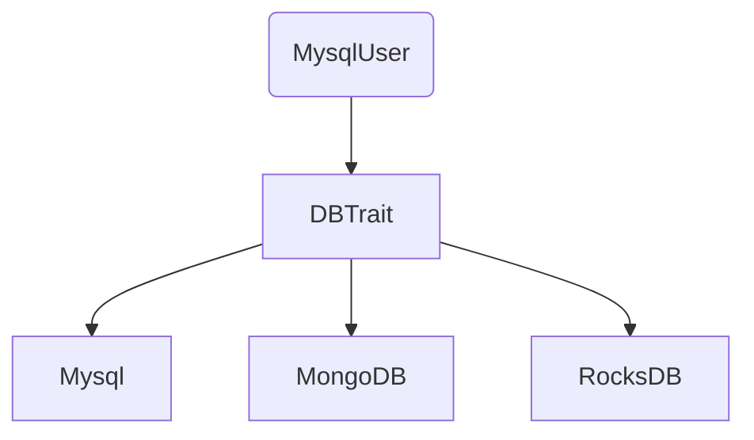

With this RFC, the implementation of `DBTrait` for each of the database crates
would be distributed among multiple implementation crates. Downstream users
would only need to take a dependency on the specific implemenetations they need.

In this example, `MysqlUser` depends only on `DBTrait` and `DBMysql`, and is
unaffected by the `DBMongo` and `DBRocks` implementations.
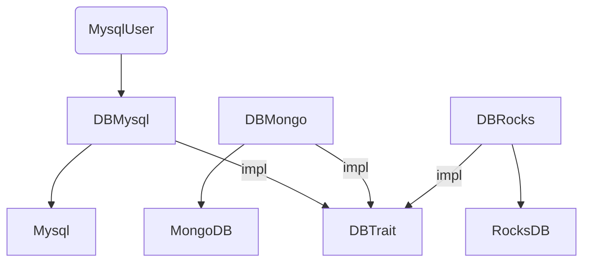
# Guide-level explanation (cargo)
[guide-level-explanation]: #guide-level-explanation 

Within a workspace, you can designate an "impl" relationship between two crates.
For example, in your `my_impls/Cargo.toml` you can put:

```
[dependency]
my_definitions = { version = "0.1", path = "../my_definitions", impl = True }
```

This means that your `my_impls` crate can add trait implementations using types
or traits defined in `my_definitions`, almost as if they were defined in
`my_definitions`. If you want to use those implementations in other crates,
however, you must also add a dependency to both `my_impls` and `my_definitions`
(or you could re-export the definitions in `my_impls`).

You may only implement for types/traits actually defined in `my_definitions`
itself. Re-exports don't count.

The dependency *must* be a path dependency to another crate defined in the same
workspace. Cargo will not allow you specify `impl = True` for other crates.

Publishing packages with any `impl = True` dependencies to crates.io is not
allowed.

# Guide-level explanation (rustc)

In current Rust, when you specify in your build system that a crate depends on
another, this is a "use" dependency - the dependee can use definitions in the
dependant.

This RFC defines a new dependency relationship: the "impl" dependency. The
dependee can provide implementations for types and traits defined in the
dependant.

We extend the `rustc` `--extern` flag with an additional `impl` flag: `--extern
impl:dbtrait=dbtrait.rlib`. This means that the crate currently being compiled
with this option, is allowed to implement traits and methods for types defined
in the `dbtrait` crate (the *defining* crate).

For example:
```rust
//! Defining crate
trait DBTrait {}
```
```rust
//! Implementation crate, also depends on the `mysql` crate.
use mysql::MySql;

// Allowed because we're depending on `dbtrait` with `impl`
impl dbtrait::DBTrait for MySql {}
```

In other words, when the overlap check is considering what definitions are
"local",  both the implementing crate and the defining crate both count. Note
that you may only implement traits and types for crates directly defined in the
defining crate &mdash; you cannot implement re-exported types.

The defining and implementing crates are not the same in other respects. They
still have distinct crate names, defining their own crate-level namespaces. For
example, if they both defined a type `Foo`, it would be two definitions
`defining::Foo` and `implementing::Foo`.

The terms "implementing" and "defining" describe a property of the dependency
relationship between two crates, not an intrinsic property of the crates
themselves. There are no other constraints on the defining and implementing
crates - they can freely define new traits, types and other items, and
implementations for those types and traits. An implementing crate can be a
defining crate for another crate.

Regardless, the definitions within the defining crate, the implementing crate,
and between the implementing crate and defining crate must meet the current
coherence requirements. Also if there are multiple implementation crates in
scope in the dependency graph, they must also be coherent.

# Reference-level explanation
[reference-level-explanation]: #reference-level-explanation

> The idea of trait
> [coherence](https://rust-lang.github.io/chalk/book/clauses/coherence.html) is
> that, given a trait and some set of types for its type parameters, there
> should be exactly one impl that applies.

A key part of this are *overlap checks*, which check that not only are there
currently no conflicting implementations, but adding new implementations won't
invalidate or change the meaning of existing code.

These overlap checks can only be performed if all the relevant implementation
sites are known so they can be checked. This is the role of the *orphan rule*,
which has the consequence that there's only one possible crate in which contain
a given implementation. This is the restriction this RFC proposes to loosen.

We introduce what could be called *the adoption rule*. This is an extension of
the orphan rule, in which implementations can be in more than one crate, but
some other crate adopts those implementation crates in order to apply the
overlap check across them in order to guarantee coherence.

The actual details of the overlap check logic are unchanged; the only change is
a wider definition of what's considered a "local definition".

## Changes to coherence checking

The key problem we need to solve is how to reconcile the Rust language-level
details (types and traits) with the build system view (dependency relationship
between crates). Coherence is defined in terms of type/trait definitions and
implementations, which forms its own graph. This graph is embedded in the crate
dependency graph &mdash; that is there are no edges in the type/trait
implementation graph which are not also present in the crate dependency graph.

Note that a blanket implementations - `impl<T> Foo for T` - are a universal
quantifier over all types `T`, whether they're in scope or not. However if we're
interested in applying it to specific concrete types, we need only consider
those types which are in scope, which are therefore constrained by the
dependency graph.

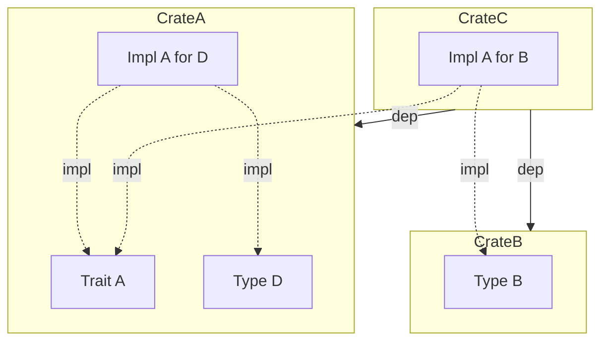

For the discussion below, crate B is visible to crate A if it falls within its
transitive dependencies; a crate is visible to itself.

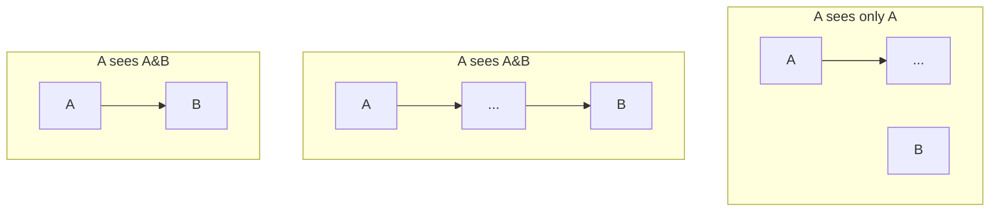

The general rule is when compiling a crate, `rustc` must check the coherence of
a set of implementations for a type if:
- all those implementations are visible
- no other visible crate has checked them

This means the compilation of a crate must check for coherence when:
- all the definitions and implementations are within one crate
- if a crate A has an impl dependency (ie, a direct dependency with the impl
  option) on crate B, it must check coherency between A and B
- if a crate has two or more crates with implementations for a given definition
  within its view via distinct direct dependencies

This last point is the most complex. For example:
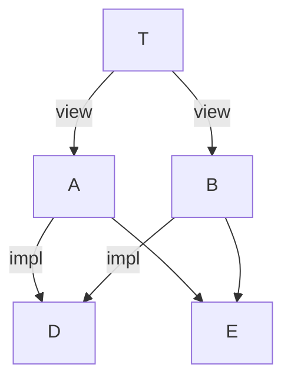
Here, `T` must check `A` and `B`'s implementations are coherent with respect to
each other and definitions in `D` and `E`. It can rely that `A` and `B` are each
individually coherent with respect to `D` and `E` because that would have been
checked when `A` and `B` were compiled.

Note that while `A` and `B` both depend
on `D` and `E`, they need only have a `impl` dependency on one of them; the `impl`
dependency simply means that `D`'s definitions are considered local to `A` and
`B` when seen in terms of the current orphan rule.

This is OK even if `A` and `B` have different `impl` dependencies:
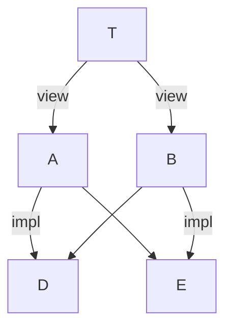
Since the groups (`A`, `D` `E`) and (`B`, `D` `E`) must be internally coherent,
and `T` still needs to check the coherence of (`A` and `B`).

In this case:
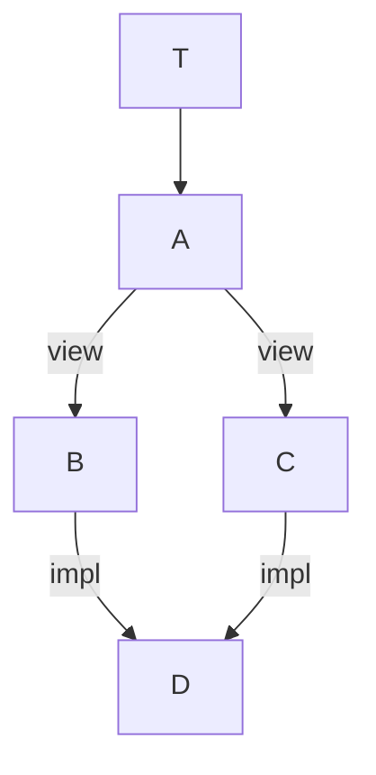
`A` must check the coherence of `B` & `C`'s implementations with respect to `D`.
`T`, however, can rely on `A` having already checked `B` and `C`'s coherence
because both are visible through it's `A` dependency.

A more complex example:
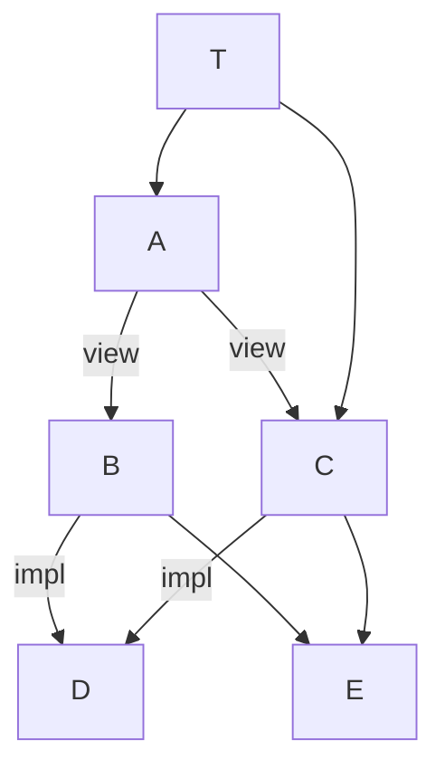
`T` can rely on `A` to check the coherence of `B` and `C`, even though `T` has
its own direct dependency on `C`, because `C` is also visible through `A`.

But in this case:
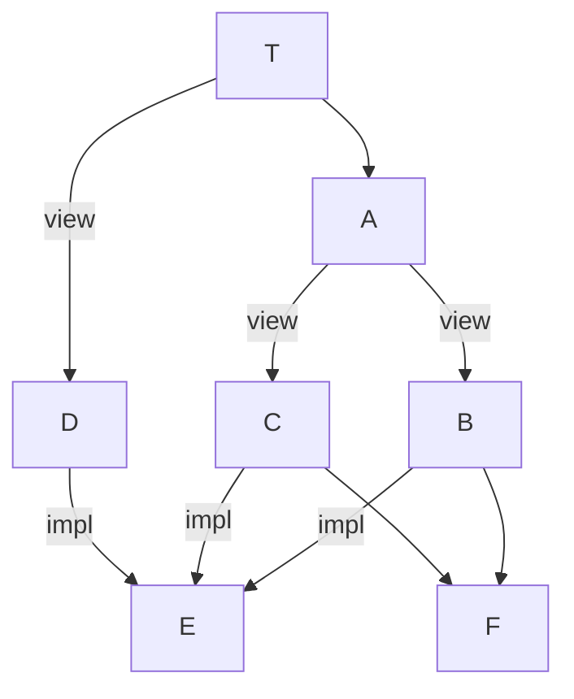
`T` can rely on `A` for the coherency of `B` and `C`, but it must check the
coherence of `B`, `C` and `D` with respect to `E`.

Note that this can mean that the same crates' coherency can be checked
redundantly. For example:
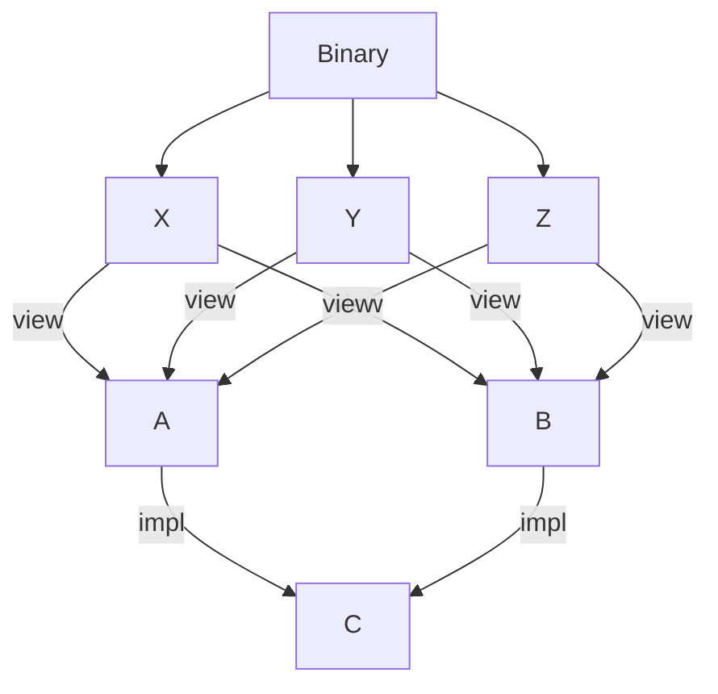
`X`, `Y` and `Z` are all the first to see the implementations of `A` and `B`
with respect to `C`, so must each do their own coherency checks, even though
`Binary` only needs for this to be performed once. Fortunately these redundant
checks can be done in parallel, but it's still a waste of CPU. See below for
some discussion about optimizing this.

# Drawbacks
[drawbacks]: #drawbacks

This adds a fair amount of complexity to a delecate part of the language
semantics and to the compiler's implementation of it. This is opt-in, but one
would need to understand these semantics when using other people's packages
which use this feature.

If implemented as described here, and enabled in Cargo in an unconstrainted way,
it would enable full third-party implementations. That is, anyone could publish
a package implementing any type or trait in any other package. This would be
fine at small scalle, but at large scales it would mean that if there were two
crates with conflicting implementations, then could never appear in the same
dependency graph. That is a change to private dependencies, which wouldn't
usually be considered compatibility breaking, would cause downstream build
breakage. This would lead to very undesireable ecosystem-wide dynamics. As such
how this feature is used must be very carefully considered.

# Rationale and alternatives
[rationale-and-alternatives]: #rationale-and-alternatives

## Features

In principle you could use Cargo "features" to achieve similar outcomes to the
motivating `DBTrait` example above - you'd define a feature for each DB
implementation, and the consumer would only enable the specific implementations
they want.

For relatively small Cargo-defined projects, this would probably work fine. You
would lose some of the benefits (like type-only crates for use in declarations),
but it would solve the fundamental "don't want to depend on every DB" problem.

However, because features are additive, as the dependency graphs get larger it
will tend towards having every feature enabled, so that every subgraph of the
overall dependency graph will end up depending on what everyone else depends on.
As a result, trait-defining crates like `DBTrait` become dependency bottlenecks
which end up single-threading the build.

(This is particularly acute in cases where Cargo is primarily used as a
dependency management tool, and builds are done with another tool like Buck.)

Sometimes features are used in a non-additive way, which is technically not
supported, but there's no mechanism to prevent it (or even warn about it). In
contrast, the mechanism described here does allow for separate implementation
crates with conflicting implementations, perhaps to allow for different
implementation tradeoffs, or bindings to different non-Rust implementations.

Extensive use of features make code navigation difficult. For example, IDE
integration (VS Code + Rust Analyzer) often won't know which features are
enabled, and so will tend to dim feature-controlled code which should be
enabled, or vice versa.

It's also hard to know which features should be enabled when generating
documentation with `rustdoc`. Not enabling features which are actually used
means that crate functionality goes undocumented, where as enabling too many
unused features can obscure the API the user actually wants to see.

# Prior art
[prior-art]: #prior-art

## Generally weak coherence

Other languages have a very weak notion of coherence. C++ doesn't enforce it at
all, and simply defines conflicting implementations as UB. Haskell allows for
ecosystem wide conflicts, which may or may not be a problem in practice. 

Rust is unique(?) in separately-compiled languages in taking such a strong stand
on this, and it's been mostly beneficial. But it would be nice to have a
mechanism to loosen the constraints on this without admitting unsoundness.

## Interface/implementation split

In C and C++, there's a clear separation between "header files" containing a
specification of an interface, and "source files" which contain actual
implementations. Typically a compilation unit which has a dependency on another
compilation unit will include the header files containing the interface
definitions, and can be compiled with that information alone; it does not requre
the implementation of the dependant to be compiled.

Ideally (and often in practice) this means that the entire program can be
compiled in parallel, with only the final linking step dependent on all the
compilation units.

The primary disadvantage of this scheme is that the header file definitions must
be manually kept in sync with the implementations, and failing to do so can
cause numerous poor outcomes from linker errors to undefined behaviour.

Today, Rust approximates this interface/implementation split with pipelined
builds, where `rustc` will generate a metadata object containing a crates
definitions, followed by actual code generation. The dependent compilation can
start as soon as the metadata is available without having to wait for the
generated code. But this still requires metadata for the entire dependency chain
- and for many crates the metadata generation *is* the expensive part of
compilation.

With this RFC the split can be made more explicit by having actual separate
crates for definitions and implementations.

# Unresolved questions
[unresolved-questions]: #unresolved-questions

Intended for close coupled crates from same origin, but *could* be used for
generic third-party impls.

The big question is what this looks like from a crates.io perspective. If we
could guarantee that `cargo publish` published an entire workspace atomically,
then 


# Future possibilities
[future-possibilities]: #future-possibilities

## Support intrinsic implementations

This RFC focuses on implementing traits for types, since this is the common pain
point. In principle everything described above will also work for intrinsic
implementations, but there's some awkward secondary questions. For example,
intrinsic implementations tend to access the private fields of structs; does
that mean we need add or redefine visibility rules?

## "Global" third-party implementations

If this mechanism were broadly enabled for the crates.io ecosystem, it could
cause undesireably ecosystem splits. For example if you have type-defining
package `some_type` and trait defining package `some_trait`, you could have two
separate crates `A` & `B` implementing `some_trait` for `some_type`. If your
package `my_package` contains just one of `A` or `B` in its dependencies, then
all is OK. But at any point, with only a minor patch update, any package could
add the other to its dependencies, preventing your package from compiling. This
kind of brittleness is highly undesireable.

So is there some way to enable third-party these kinds of third-party
implementation crates in a more general way without introducing this kind of
ecosystem brittleness?

The [namespacing RFC](https://github.com/Manishearth/namespacing-rfc)
([PR)(https://github.com/rust-lang/rfcs/pull/3243)]) is also looking at
questions relating the the overall crates.io ecosystem. One could imagine a
proposal, for example, that packages within the same namespace could have this
`impl` relationship. But whether that makes sense really depends on the intended
semantics of namespaces.

## Cached coherence checks

There are cases where the same coherence properties may be checked multiple
times, if the same implementing crates are dependencies of multiple unrelated
crates. Perhaps these checks could be memoized with the incremental machinery to
avoid the redundancy.


## Auto-split crates

Modules
within crates may have cyclic dependencies, but the crate dependency graph must
be acyclic. But only in extremely pathological cases will a crate's internal
dependency graph consist of a single strongly connected component.

This opens the possibility of using the mechanism described in this RFC to
automatically partition a crate into sub-crates in order to expose more
built-time parallelism. This could either be performed inline during the build
or some tooling to perform pre-build processing on the crates.

# Appendix - Alloy spec (WIP)

---
title: Alloy spec for Rust implementation coherency
---

Note: this is a literate [Alloy](https://alloytools.org/) spec. Download the
most recent version of Alloy from
https://github.com/AlloyTools/org.alloytools.alloy/releases, and see
https://alloy.readthedocs.io for documentation.

# Alloy spec for Rust implementation coherency

(TODO: make this fully consistent with the description above.)

This is a simplified spec of Rust coherency checking. Rust requires that there
are no overlapping or conflicting implementations with a complete Rust program,
as that would allow for ambiguity about which one to use.

(This applies to all implementations, but here we're only going to consider the
subset of simple trait implementations for types, with no generic type
parameters.)

## Alloy Spec

First we define signatures for types and traits. Both are defined in a crate:

```alloy
sig Trait {
    trait_def: one Crate
}

sig Type {
    type_def: one Crate
}
```

And crates themselves. Crates can depend on a set of other crates, but the
overall crate dependency graph must be acyclic. Each crate also has a relation
of which trait implementations for which types it contains.

```alloy
sig Crate {
    deps: set Crate,
    impls: Trait -> Type,
} {
    no this & this.^@deps -- acyclic
}
```

A Binary is the unique "top-level" crate which depends on all the other crates
transitively. Or to put it another way, no other crate depends on Binary.

```alloy
one sig Binary extends Crate {} {
    no @deps.this -- nothing depends on Binary
    all c: Crate - Binary | c in this.^@deps -- Binary depends on everything else
}
```

Let's define the safety invariant we need to enforce, that every implementation
is unique. Or more precisely, for every trait/type pair, there's at most one
crate implementing it. (It's fine if nothing implements it.)

```alloy
pred coherent_impls[crates: Crate] {
    all tr: Trait, ty: Type | lone crates & impls.ty.tr
}
``````

This is the basic orphan rule, with a tight definition of "local": either the
type or the trait must be defined in the crate:

```alloy
pred local_orphan_rule[crates: Crate] {
    all crate: crates |
        crate.impls in
            (crate[trait_def] -> (crate + crate.deps)[type_def]) +
            ((crate + crate.deps)[trait_def] -> crate[type_def])
}
```

We can check that if `local_orphan_rule` is true for all crates, then we have
coherence for all crates. This has no counter-examples.

```alloy
check local_coherent {
    -- ie, checking local_orphan_rule on each crate implies that all crates are globally coherent
    local_orphan_rule[Crate] => coherent_impls[Crate]
}
```

## impl dependencies

Let's extend the orphan constraint so that the definition of "local" is extended
to immediate dependencies as well. In a way this is simpler than
`local_orphan_rule` because we no longer have to constrain either the type or
trait to be in `crate`.

```alloy
pred dep_orphan_rule[crates: Crate] {
    all crate: crates |
        crate.impls in
            (crate + crate.deps)[trait_def] -> (crate + crate.deps)[type_def]
}
```

However, this is not sufficient to maintain the invariant. This will quickly
find a counter-example with two crates with a duplicate implementation.

```alloy
check dep_coherent_bad {
    dep_orphan_rule[Crate] => coherent_impls[Crate]
}
```

We need to add additional constraints to maintain the invariant. First, let's
define a function which, for a given crate which defines types and/or traits,
all the crates with implementations for those definitions:
```alloy
fun impl_crates[c: Crate]: set Crate {
    c[trait_def][impls.univ] + c[type_def][impls].univ
}
```

We can then apply the constraint in the most general way: for all dependencies
of Binary, all the crates implementing anything must be coherent. We'll ignore
that this is a tautology for now, as we'll tighten this up later.

```alloy
check dep_coherent_impl_crates {
    {
        dep_orphan_rule[Crate] -- redundant
        all dep: Binary.*deps |
            coherent_impls[impl_crates[dep]] -- tautology
    } => coherent_impls[Crate]
} for 10 -- make sure there's enough objects to be interesting
```

Unfortunately, this doesn't correspond to how the build is actually performed in
practice. When we're compiling a crate which has definitions, we don't know
which crates will have implementations. And when we're compiling the crates with
implementations, we don't know which other crate to cross-check with for
coherence.

The key insight is that there must be *some* crate which has both the
implementing crates in its transitive dependencies (even if it's the top-level
Binary), which means it can check for coherence when compiling that crate.

For example, here `Use` is responsible for checking the coherence of `ImplA` and
`ImplB` in its dependencies, but `ImplC` someone else's problem, and `Other` is
not relevant.
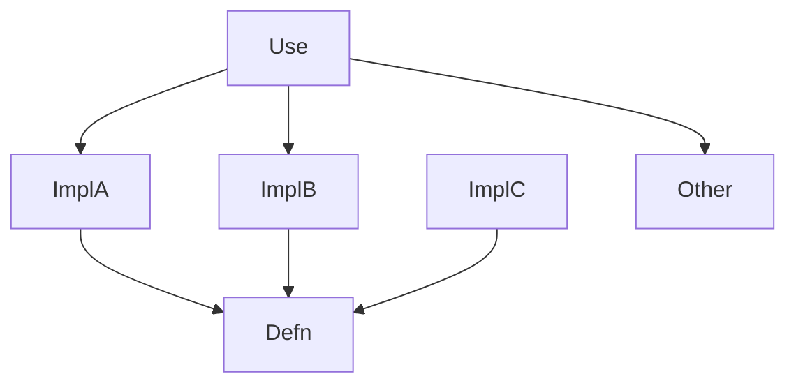

```alloy
-- TODO check constraint for common deps
```
