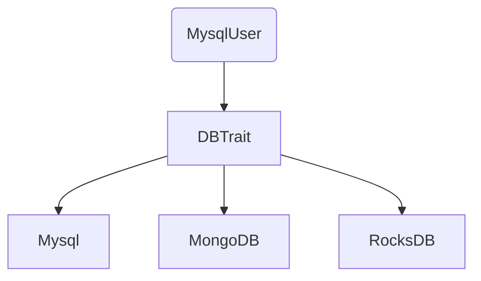
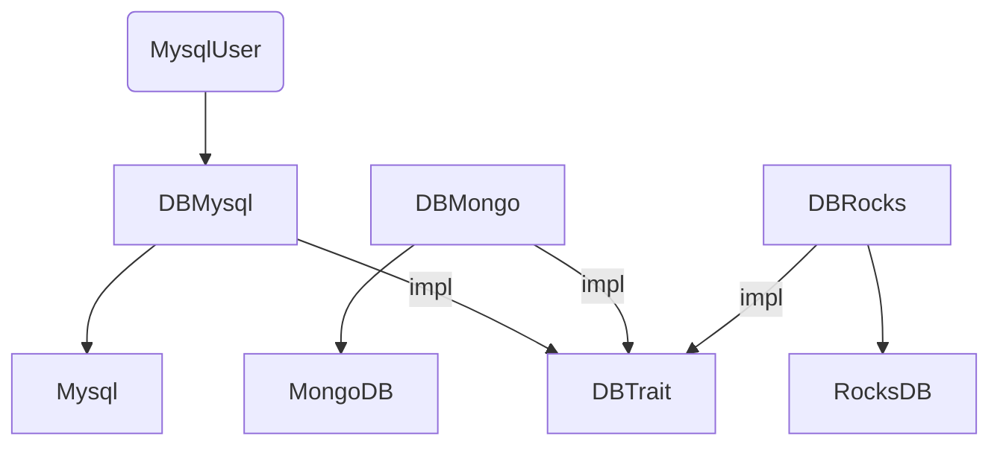
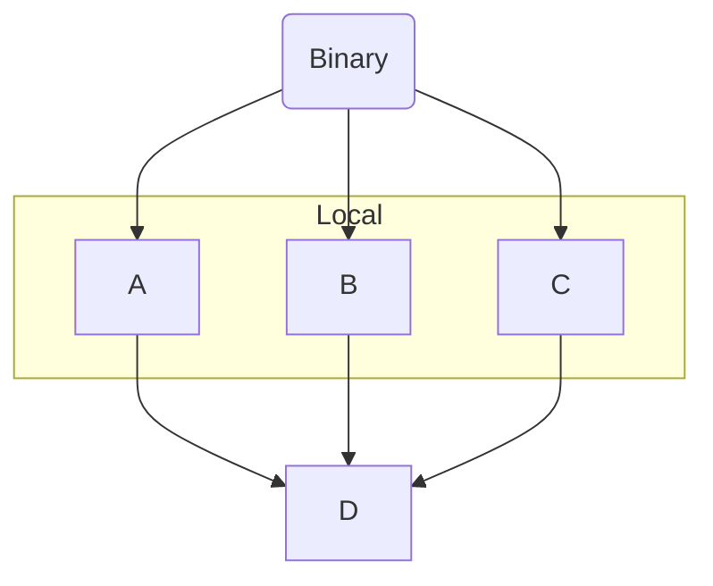
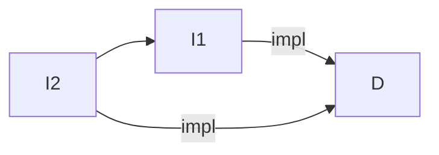
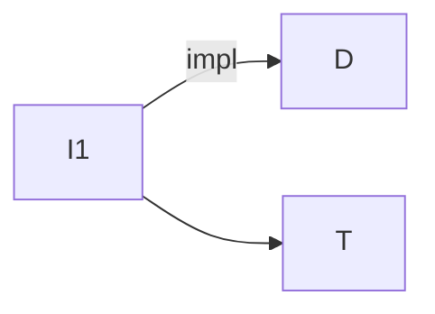
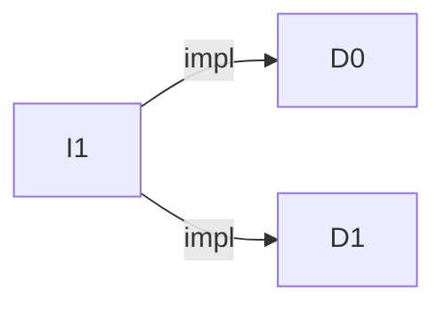
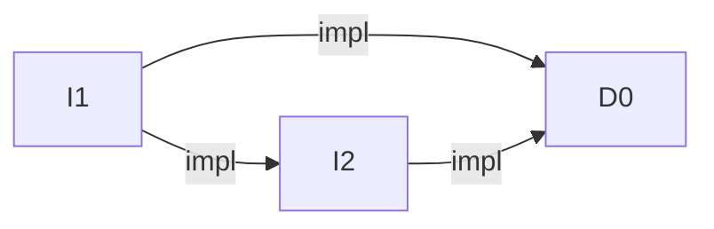
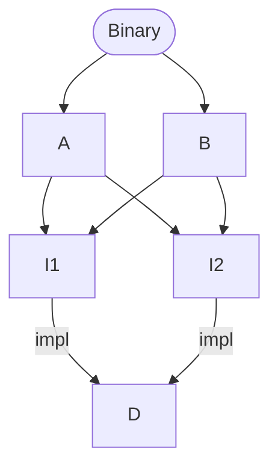
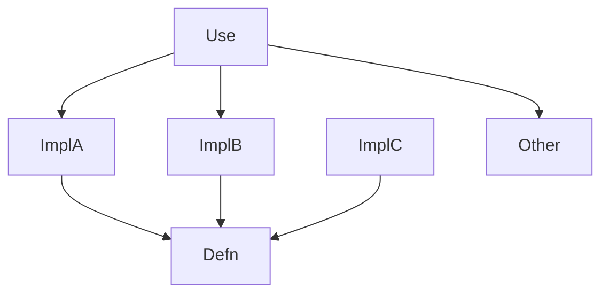

- Feature Name: extern_impl
- Start Date: 2023-07-17
- RFC PR: [rust-lang/rfcs#0000](https://github.com/rust-lang/rfcs/pull/0000)
- Rust Issue: [rust-lang/rust#0000](https://github.com/rust-lang/rust/issues/0000)

# Summary
[summary]: #summary

This RFC proposes a mechanism to allow `impl`s for a type or trait to be in a
separate crate, while still meeting the soundness guarantees currently enforced
by the orphan rule. This allows the code author to use the build system to more
flexibly partition functionality among crates.

# Motivation
[motivation]: #motivation

In order to guarantee coherence, Rust currently imposes the fairly strict orphan
rule. That is:
- only a crate defining a type can have inherent implementations for that type,
  or for any traits, and
- only a crate defining a trait can implement that trait for any type

In other words, a crate is not allowed to have "third-party implementations" -
it's not allowed to add new inherent implementations to a non-local type, nor is
it allowed to implement a non-local trait for a non-local type.

This raises a number of problems, but this RFC's principle concern is that of
dependency graph scaling and build performance. Specifically, the current orphan
rule sets a hard limit how finely implementations can be distributed amongst
crates.

For example:

- When introducing a new trait, it's useful to provide implementations for other
  external types. But this means the trait-definition crate takes on
  depdendencies on all those downstream dependencies whether they're ultimately
  needed or not.
- It common for a to only use a crate for its type definitions, but not need any
  of it's implementations (for example, when mentioning a type in a function
  signature or another type definition). However, with the current orphan rule,
  this would require waiting for the full crate to compile, including all of its
  dependencies. 

What this RFC proposes is a new kind of dependency relationship between two
crates, in which a crate can have an "impl" dependency on a crate defining a
type or trait, and coherence is a computed over more than one crate.

## More concrete example

Say you've just written a new crate which defines a univeral interface to all
types of databases, called `DBTrait`. You want to make this trait useful from
the outset by implementing it for a number of existing DB crates.

Today this means your `DBTrait` crate would need to take dependencies on every
one of those DB crates in order to do `impl DBTrait for X`. It also means that
every downstream user of `DBTrait` would also transitively gain those
dependencies.

Here, `MysqlUser` ends up depending on all of `Mysql`, `MongoDB` and `RocksDB`
even though it only cares about `Mysql`.


With this RFC, the implementation of `DBTrait` for each of the database crates
would be distributed among multiple implementation crates. Downstream users
would only need to take a dependency on the specific implemenetations they need.

In this example, `MysqlUser` depends only on `DBTrait` and `DBMysql`, and is
unaffected by the `DBMongo` and `DBRocks` implementations.

# Guide-level explanation
[guide-level-explanation]: #guide-level-explanation

This RFC defines the notion of an *defining* crate and an *implementing* crate.

We extend the `rustc` `--extern` flag with an additional `impl` flag:
`--extern impl:dbtrait=dbtrait.rlib`. This means that *this* crate (the
*implementing* crate), that rustc is currently compiling, is allowed to
implement traits and methods for types defined in the `dbtrait` crate (the
*defining* crate).

For example:
```rust
//! Defining crate
trait DBTrait {}
```
```rust
//! Implementation crate, also depends on the `mysql` crate.
use mysql::MySql;

// Allowed because we're depending on `dbtrait` with `impl`
impl dbtrait::DBTrait for MySql {}
```

In other words, the implementing crate is considered the same as the defining
crate as far as the orphan rule goes. Note that you may only implement traits
and types for crates directly defined in the defining crate &mdash; you cannot
implement re-exported types.

The implementing crate is also considered the same as the defining crate from a
visibility perspective - it will be able to access `pub(crate)` modules, types,
fields, methods, etc in the defining crate (though in this case including
re-exports).

The defining and implementing crates are not the same in other respects. They
still have distinct crate names, defining their own crate-level namespaces. For
example, if they both defined a type `Foo`, it would be two definitions
`defining::Foo` and `implementing::Foo`.

There are no other constraints on the defining and implementing crates - they
can freely define new traits, types and other items, and implementations for
those types and traits. An implementing crate can be a defining crate for
another crate.

Regardless, the definitions within the defining crate, the implementing crate,
and between the implementing crate and defining crate must meet the current
coherence requirements. Also if there are multiple implementation crates in
scope in the dependency graph, they must also be coherent.

# Reference-level explanation
[reference-level-explanation]: #reference-level-explanation

[Coherence](https://rust-lang.github.io/chalk/book/clauses/coherence.html) is
currently defined in terms of "local" definitions - that is, items defined with
in the current crate.

This RFC does not change the definition of Coherence, just the definition of
"local". Instead of only considering items defined in one specific crate, it
defines a set of crates whose definitions are considered "local".

This set is defined in terms of immediate dominators in the crate dependency
graph.

Some definitions & axioms:
- a dependency graph always has a top-level crate (typically a binary) which:
  - has no dependencies
  - only crates which it transitively depends on are relevant
- a "local set" of crates TODO
- an implementing crate must have a dependency relationship to a defining crate
  in order to actually have implementations
- a crate always dominates itself
- a crate is the dominator of other crates if it's on the only path to
  those other crates
 - it's the immediate dominator if it's the closest on that path

So given this example compiling binary crate `Binary`:
```mermaid
graph TB
 Bin(Binary) --> A & B
 A & B -->|impl| C
 D -->|impl| C
 ```
- When compiling `C`, because it dominates itself, `rustc` must check that
  it is internally coherent (this is identical to today)
- When compiling `A`, which dominates itself and `C`, `rustc` must check `A` is
  internally coherent and coherence between `A` and `C`. Likewise `B` with
  respect to `C`.`
- `Binary` dominates both `A` and `B`, so when compiling it `rustc` must check
  for coherence between them. It doesn't need to worry about coherence between
  `A` and `C`, nor `B` and `C`, since that's already been checked.
- `D` is not relevant to any of this, as it is not in `Binary`'s transitive
  dependencies, and its coherence is not checked.

In a more complex example:
```mermaid
graph TB
 Bin(Binary) --> A & C
 A --> D & E
 C & D & E -->|impl| F
 ```
 - `F` must be internally coherent, likewise `D` & `E` with respect to `F`.
 - Compiling `A` must check for coherence between `D` and `E` with respect to `F`
 - Compiling `Binary` must check for coherence between `C`, `D` and `E` (which
   may be able to take advantage of the knowledge that `D` and `E` are already
   coherent because `A` already checked it.)

## Changes to coherence checking

In the simple case, when checking the coherence between an implementing crate
and the defining crate, definitions in both the defining and implementing crate
are considered "local". Aside from that, the algorithm then proceeds as before.
Here, implementing crates `A`, `B` and `C` are each considered local to defining crate `D`, but not to each other.
```mermaid
graph TD
  A & B & C --> D
```

When checking the coherence of multiple implementing crates, we must be careful
with the definition of "local". Since the implementing crates don't depend on
each other, and can't have implementations for each other's types, we can safely
consider them local to each other with respect to the defining crate `D` for the
purposes of coherence checking.



## Extra cases

Impl crates depend on each other

Impl crates use other crates (common)

Impl crates implement multiple definition crates

Impl crates define types and have their own impl crates

Duplicated checking -- `A` and `B` would both check the coherence of `I1` and
`I2` with respect to each other, since neither knows about the other. 


# Drawbacks
[drawbacks]: #drawbacks

This adds a fair amount of complexity to a delecate part of the language
semantics and to the compiler's implementation of it. I've tried to keep the
changes as light-touch as possible, but I haven't tried to prototype it yet.

If implemented as described here, and enabled in Cargo in an unconstrainted way,
it would enabled full third-party implementations. That is, anyone could publish
a crate implementing any trait for any type. This would be fine in the small,
but at large scales it would mean that if there were two crates with conflicting
implementations, then could never appear in the same dependency graph. It means
that non-local changes to dependencies could cause downstream build breakage.
This would lead to very undesireable ecosystem-wide dynamics. As such how this
feature is used must be very carefully considered.

# Rationale and alternatives
[rationale-and-alternatives]: #rationale-and-alternatives

In principle you could use Cargo features to achieve similar outcomes to the
motivating `DBTrait` example above - you'd define a feature for each DB
implementation, and the consumer would only enable the specific implementations
they want.

For relatively small Cargo-defined projects, this would probably work fine. You
would lose some of the benefits (like type-only crates for use in declarations),
but it would solve the fundamental "don't want to depend on every DB" problem.

However, because features are additive, as the dependency graphs get larger it
will tend towards having every feature enabled, so that every subgraph of the
overall dependency graph will end up depending on what everyone else depends on.
As a result, trait-defining crates like `DBTrait` become dependency bottlenecks
which end up single-threading the build.

(This is particularly acute in cases where Cargo is primarily used as a
dependency management tool, and builds are done with another tool like Buck.)

# Prior art
[prior-art]: #prior-art

...?

Other languages have a very weak notion of coherence. C++ doesn't enforce it at
all, and simply defines conflicting implementations as UB. Haskell allows for
ecosystem wide conflicts, which may or may not be a problem in practice. 

Rust is unique(?) in separately languages in taking such a strong stand on this,
and it's been mostly beneficial. But it would be nice to have a mechanism to
loosen the constraints on this without admitting unsoundness.

# Unresolved questions
[unresolved-questions]: #unresolved-questions

Intended for close coupled crates from same origin, but *could* be used for
generic third-party impls.

The big question is what this looks like from a Cargo perspective. I can think
of a few options:
- Extend the namespace proposal so that crates in the same namespace can have
  `impl` relations
- Multi-crate Cargo packages, which allow internal `impl` dependencies


# Future possibilities
[future-possibilities]: #future-possibilities

Allow transitive impl relations. For example:

Allowing `A` to implement items in `C` because of the transitive `impl`
relationship through B. I think this potentially complicates the correctness
analysis a lot though, and doesn't really have a lot of benefits over just
making `A` depend on `C` directly.

There's a question on whether to globally enforce coherence even between crates
which are not in the same dependency graph. This could be particularly useful at
crates.io publication time to make sure the package doesn't have lurking
problems. On the other hand there might be cases where it's desireable to allow
incoherent implementations to exist; for example, two implementations of the
same API with different algorithms tuned for different use-cases.

There are cases where the same coherence properties may be checked multiple
times. Perhaps these checks could be memoized with the incremental machinery to
avoid the redundancy.

# Appendix - Alloy spec (WIP)

---
title: Alloy spec for Rust implementation coherency
---

Note: this is a literate [Alloy](https://alloytools.org/) spec. Download the
most recent version of Alloy from
https://github.com/AlloyTools/org.alloytools.alloy/releases, and see
https://alloy.readthedocs.io for documentation.

# Alloy spec for Rust implementation coherency

This is a simplified spec of Rust coherency checking. Rust requires that there,
are no overlapping or conflicting implementations with a complete Rust program,
as that would allow for ambiguity about which one to use.

(This applies to all implementations, but here we're only going to consider the
subset of simple trait implementations for types, with no generic type
parameters.)

The current solution to this is to requires that when a crate implements a trait
for a type, at least one of the type or the trait have to be "local" - ie,
defined in the same crate.

This is simple to describe and implement, but in practice it has several downsides:
- (dependencies, no third-party impls)

## Alloy Spec

First we define signatures for types and traits. Both are defined in a crate:

```alloy
sig Trait {
    trait_def: one Crate
}

sig Type {
    type_def: one Crate
}
```

And crates themselves. Crates can depend on a set of other crates, but the
overall crate dependency graph must be acyclic. Each crate also has a relation
of which trait implementations for which types it contains.

```alloy
sig Crate {
    deps: set Crate,
    impls: Trait -> Type,
} {
    no this & this.^@deps -- acyclic
}
```

A Binary is the unique "top-level" crate which depends on all the other crates
transitively. Or to put it another way, no other crate depends on Binary.

```alloy
one sig Binary extends Crate {} {
    no @deps.this -- nothing depends on Binary
    all c: Crate - Binary | c in this.^@deps -- Binary depends on everything else
}
```

Let's define the safety invariant we need to enforce, that every implementation
is unique. Or more precisely, for every trait/type pair, there's at most one
crate implementing it. (It's fine if nothing implements it.)

```alloy
pred coherent_impls[crates: Crate] {
    all tr: Trait, ty: Type | lone crates & impls.ty.tr
}
``````

This is the basic orphan rule, with a tight definition of "local": either the
type or the trait must be defined in the crate:

```alloy
pred local_orphan_rule[crates: Crate] {
    all crate: crates |
        crate.impls in
            (crate[trait_def] -> (crate + crate.deps)[type_def]) +
            ((crate + crate.deps)[trait_def] -> crate[type_def])
}
```

We can check that if `local_orphan_rule` is true for all crates, then we have
coherence for all crates. This has no counter-examples.

```alloy
check local_coherent {
    -- ie, checking local_orphan_rule on each crate implies that all crates are globally coherent
    local_orphan_rule[Crate] => coherent_impls[Crate]
}
```

## impl dependencies

Let's extend the orphan constraint so that the definition of "local" is extended
to immediate dependencies as well. In a way this is simpler than
`local_orphan_rule` because we no longer have to constrain either the type or
trait to be in `crate`.

```alloy
pred dep_orphan_rule[crates: Crate] {
    all crate: crates |
        crate.impls in
            (crate + crate.deps)[trait_def] -> (crate + crate.deps)[type_def]
}
```

However, this is not sufficient to maintain the invariant. This will quickly
find a counter-example with two crates with a duplicate implementation.

```alloy
check dep_coherent_bad {
    dep_orphan_rule[Crate] => coherent_impls[Crate]
}
```

We need to add additional constraints to maintain the invariant. First, let's
define a function which, for a given crate which defines types and/or traits,
all the crates with implementations for those definitions:
```alloy
fun impl_crates[c: Crate]: set Crate {
    c[trait_def][impls.univ] + c[type_def][impls].univ
}
```

We can then apply the constraint in the most general way: for all dependencies
of Binary, all the crates implementing anything must be coherent. We'll ignore
that this is a tautology for now, as we'll tighten this up later.

```alloy
check dep_coherent_impl_crates {
    {
        dep_orphan_rule[Crate] -- redundant
        all dep: Binary.*deps |
            coherent_impls[impl_crates[dep]] -- tautology
    } => coherent_impls[Crate]
} for 10 -- make sure there's enough objects to be interesting
```

Unfortunately, this doesn't correspond to how the build is actually performed in
practice. When we're compiling a crate which has definitions, we don't know
which crates will have implementations. And when we're compiling the crates with
implementations, we don't know which other crate to cross-check with for
coherence.

The key insight is that there must be *some* crate which has both the
implementing crates in its transitive dependencies (even if it's the top-level
Binary), which means it can check for coherence when compiling that crate.

For example, here `Use` is responsible for checking the coherence of `ImplA` and
`ImplB` in its dependencies, but `ImplC` someone else's problem, and `Other` is
not relevant.


```alloy
-- TODO check constraint for common deps
```
