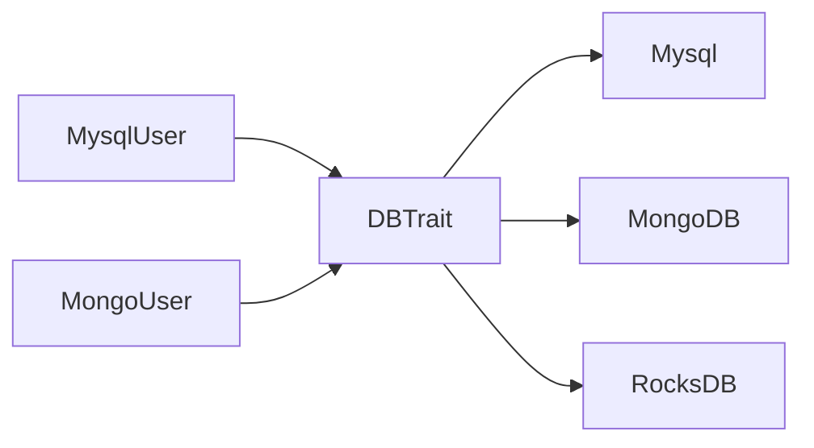
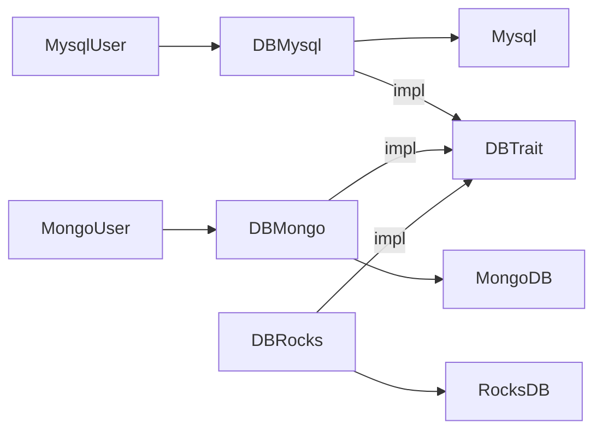
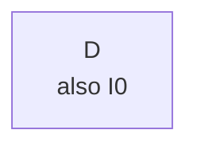
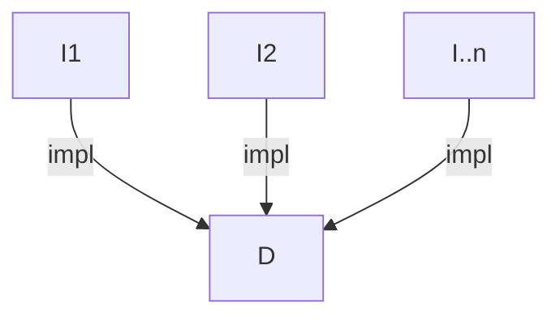
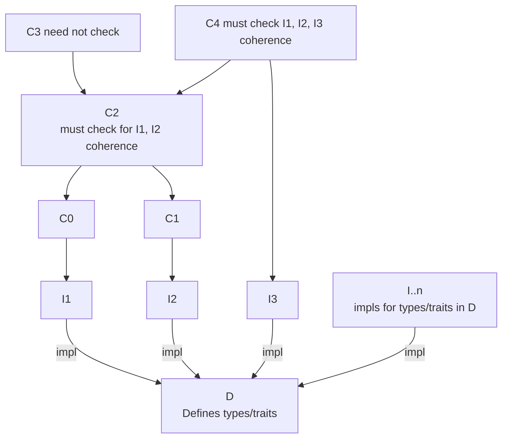
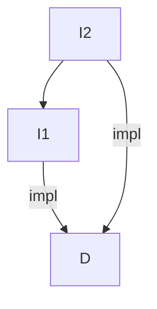
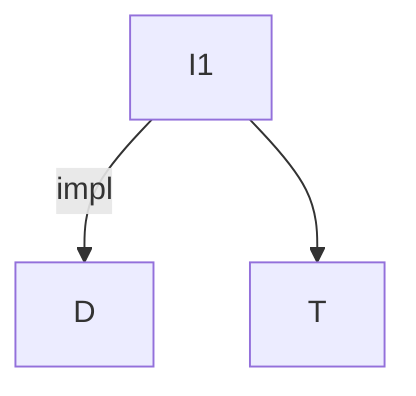
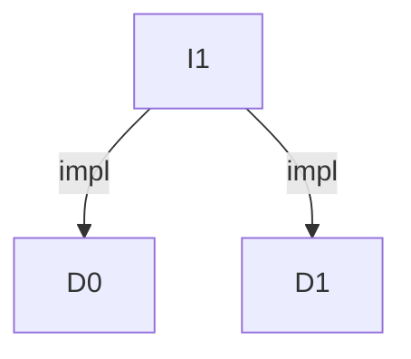
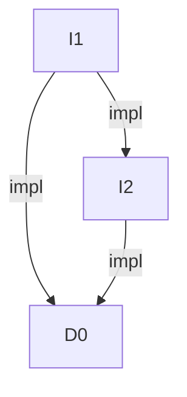

- Feature Name: (fill me in with a unique ident, `my_awesome_feature`)
- Start Date: (fill me in with today's date, YYYY-MM-DD)
- RFC PR: [rust-lang/rfcs#0000](https://github.com/rust-lang/rfcs/pull/0000)
- Rust Issue: [rust-lang/rust#0000](https://github.com/rust-lang/rust/issues/0000)

# Summary
[summary]: #summary

This RFC proposes a mechanism to allow `impl`s for a type or trait to be in a
separate crate, while still meeting the soundness guarantees currently enforced
by the orphan rule.

# Motivation
[motivation]: #motivation

In order to guarantee coherence, Rust currently imposes the fairly strict orphan
rule. That is:
- only a crate defining a type can have inherent implementations for that type,
  or for any traits, and
- only a crate defining a trait can implement that trait for any type

In other words, a crate is not allowed to have "third-party implementations" -
it's not allowed to add new inherent implementations to a type, nor is it
allowed to implement a foreign trait for a foreign type.

This raises a number of problems, but this RFC's principle concern is that of
build performance and dependency graph scaling. 

For example:

- It common for a to only use a crate for its type definitions, but not need any
  of it's implementations (for example, when mentioning a type in a function
  signature or another type definition). However, with the current orphan rule,
  this would require waiting for the full crate to compile, including all of its
  dependencies. 
- When introducing a new trait, it's useful to provide implementations for other
  external types. But this means the trait-definition crate takes on
  depdendencies on all those downstream dependencies whether they're needed or not.

~~What this RFC proposes is a mechanism which allows implementations to be
delegated to "trusted" or "friendly" crates (typically defined in the same
package), allowing downstream consumers to take on only the specific
dependencies they need. Furthermore a "witness" mechanism makes sure that the
coherence invariants currently enforced by the orphan rule are maintained.~~

Dependency graph dominator based coherence checking.

Status Quo:

Proposed:

# Guide-level explanation
[guide-level-explanation]: #guide-level-explanation

- defining crate and impl crate

`--extern impl:name=name.rlib`

- impl crate must directly depend on defining crate - re-exports don't count
- defining crate & impl crate are considered the same (eg `pub(crate)` is visible to both)
- impls in defining & impl must be coherent

# Reference-level explanation
[reference-level-explanation]: #reference-level-explanation

- "Local" for coherence checking extended from "definitions in one crate" to "definitions from set of crates"
- set of crates are impls for a definition which are downstream from dominator

Dominating crates:
- crate dominates itself (so must be internally coherent)
- impl crate dominates self and defining crate (so must be coherent)
- least dominator for a set of impl crates must guarantee coherence

Defining crate is its own implementing crates, and must be internally coherent
(ie, status quo)

Each impl crate dominates its defining crate(s) and must be coherent with them:

Least dominator of all impl crates for a given defining crate must check
coherence of impls:

## Extra cases

Impl crates depend on each other

Impl crates use other crates (common)

Impl crates implement multiple definition crates

Impl crates define types and have their own impl crates

This is the technical portion of the RFC. Explain the design in sufficient detail that:

- Its interaction with other features is clear.
- It is reasonably clear how the feature would be implemented.
- Corner cases are dissected by example.

The section should return to the examples given in the previous section, and explain more fully how the detailed proposal makes those examples work.

# Drawbacks
[drawbacks]: #drawbacks

- Complexity
- Ecosystem split

# Rationale and alternatives
[rationale-and-alternatives]: #rationale-and-alternatives

- Features?
  - only work for small-scale projects

# Prior art
[prior-art]: #prior-art

Discuss prior art, both the good and the bad, in relation to this proposal.
A few examples of what this can include are:

- For language, library, cargo, tools, and compiler proposals: Does this feature exist in other programming languages and what experience have their community had?
- For community proposals: Is this done by some other community and what were their experiences with it?
- For other teams: What lessons can we learn from what other communities have done here?
- Papers: Are there any published papers or great posts that discuss this? If you have some relevant papers to refer to, this can serve as a more detailed theoretical background.

This section is intended to encourage you as an author to think about the lessons from other languages, provide readers of your RFC with a fuller picture.
If there is no prior art, that is fine - your ideas are interesting to us whether they are brand new or if it is an adaptation from other languages.

Note that while precedent set by other languages is some motivation, it does not on its own motivate an RFC.
Please also take into consideration that rust sometimes intentionally diverges from common language features.

# Unresolved questions
[unresolved-questions]: #unresolved-questions

Intended for close coupled crates from same origin, but *could* be used for
generic third-party impls.

Corresponding Cargo part
  - Multi-crate packages?
  - Namespaces
  - Some other abstraction?

# Future possibilities
[future-possibilities]: #future-possibilities

- Transitiive impls
- Total coherence check
  - All impl crates are checked against each other for publication, even if not
    used together
  - Or deliberately allow for conflicting impls in different impl crates, eg
    different algorithms for different use-cases for the same thing