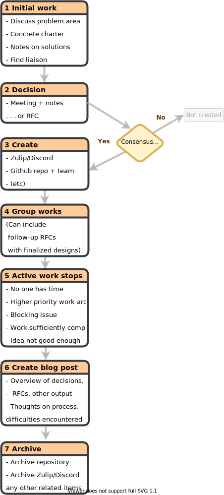

- Start Date: 2015-05-21
- RFC PR: [rust-lang/rfcs#2856](https://github.com/rust-lang/rfcs/pull/2856)
- Rust Issue: N/A

# Summary

- Formalize project groups as groups dedicated to specific projects within the
  context of a Rust team.
- Project groups are created via team consensus (such as an RFC) and have a
  "parent team(s)"
- The groups then drive the project to completion, e.g. by authoring follow-up
  RFCs and doing design work.
- Once the work has been concluded, the group is archived.
- Each project group typically has:
  - A charter outlining the group's scope and goals.
  - Appointed shepherds and team liaisons.
  - An associated repository.
  - Dedicated streams on Discord/Zulip/etc.
 
# Motivation

Working groups in Rust were not created through the RFC process, as such
there's not much documentation on exactly what a working group does, what are
its responsibilities, and also importantly setting expectations or goals. There
is one definition of "Working Group" available in [rust-lang#54445]; quoted below.

> A Rust Working Group is a set of people working at common purpose. Working
> Groups are associated with a Rust team. Unlike a Rust Team, Working Groups
> don't have "formal decision making power", though often they are charged with
> drawing up recommendations, RFCs, or other documents for the teams (which is
> then intended to make the final decision).

While this definition is true in the broad sense, it does not define the
difference between what has come to be called "Domain Working Groups" and
"Team Working Groups". This RFC aims to provide clarity by providing new distinct
terminology that matches the intent behind "Team Working Groups", as well as codify
some of the processes that these groups have been using to help facilitate creating
new groups.

[rust-lang#54445]: https://github.com/rust-lang/rust/issues/54445

# Guide-level explanation

To address this confusion this RFC proposes switching from using "Team Working
Group" in favour of "Project Group". This would serve as a catch all term for
the sub teams of the existing teams to organise around specific efforts, such
as certain project or effort in the Rust team.

**Note:** Currently existing working groups should remain working groups unless
explicitly re-proposed through the project group process detailed in this RFC.

## Life-cycle of a Project Group
This is a high level overview of the complete process of a project group.

    
    
Figure 1. Project Group Lifecycle

### Steps

1. Exploratory period.

- Initial discussions of the problem area.
  - Teams are not obligated to look at or respond to any of the initial 
    discussions. Of course, interested members are free to participate.
- Write a short motivation for the project.
- Find a person from the relevant team who's willing to act as a liaison.
  - Finding a liaison is specific to each team, you should consult the
    team's documentation on how to propose project groups.
  - You may not always be able to find someone who is willing to act as
    liaison. It's up to each team to decide how many new efforts
    they'll have the bandwidth for, which may at times be none.

2. Obtain the consensus of the team to create group.

- Specify the liaison, and shepherd(s). (See [Project Group Creation](#project-group-creation))
- Write a short motivation, and some notes on possible solutions.
- How consensus is reached would vary from team to team, some would require an
  RFC while others could decide in a meeting. (See [Future Work](#future-work))

3. Create infrastructure for group.

- GitHub repository under `rust-lang` for hosting work and discussions, such
  as for draft RFCs.
- A Discord channel or a Zulip stream for communication.
- Project group in [`rust-lang/team`], as well as a team on GitHub, for
  handling permissions.

4. Create a post on the Inside Rust blog announcing creation of the group. Be
   sure to include the following information.
  - An introduction
  - The charter (either linked or inlined) \[See [Creating The Charter](#creating-the-charter)\]
  - A link to your group's GitHub repository
  - If your group is open for participants, provide information on how they
    can contribute.
    - If you're also planning on running regular meetings, include when your
      group plans to meet along with a link to calendar event for the meeting.

5. The group works towards the goals laid out in their charter.

6. When active work has stopped a group is "archived".
- Archival can be started by the project group shepherds, the liaison, or the
  lead(s) of the parent team if needed.
- Archival is not necessarily a permanent state, it is only a reflection on the
  current status of the group.
  - Similarly a groups archival doesn't imply that work in that area has been
    exhausted
- Reasons to archive (non-exhaustive):
  - Nobody in the group has time anymore or higher priority things arose.
  - There's a blocking issue that can't be resolved.
  - Don't see any additional work to do in this area in the near future.
  - The work was done to a satisfactory state.
  - The group decided the idea wasn't so good after all.

7. Create a blog post announcing the archival of the group.

- The scope of this post will vary based on the scope of the group, but
  ideally it would include some of the following.
  - Overview of decisions, RFCs, and other output the group produced.
  - Thoughts on the process, how it worked (or didn't as case may be), any
    difficulties encountered, and what they would want to be improved.

8. Archive infrastructure.

- Archive GitHub repository to be read-only.
- Archive chat channel(s) on any platforms.

[`rust-lang/team`]: https://github.com/rust-lang/team
[internals]: https://internals.rust-lang.org

# Reference-level explanation

A Project Group is a group of people working on a particular project or
responsibilities at the behest of an official Rust team. Some project groups are
are ephemeral, meaning that they are archived once the project is complete.
However, there are project groups that have continual work and maintenance.

Examples of project groups around specific feature  include [FFI Unwind],
[Inline ASM], and [Safe Transmute]. Examples built around continual work and
maintenance could include [Triage], and [Rustup].

The goal of a project is build a community or formalise an existing community
around a particular feature or project in the organisation, and use this
space to discuss and iterate on that feature.

Part of building a community is removing some of the institutional memory that
develops in the design process, and centralising the information and discussion
around the feature so that we can provide better visibility into why certain
decisions and trade offs were made over others.

Previously a lot of the discussion and iteration for large features would
happen in the initial RFC thread. This leads to a lot of discussion in the top
of the thread and that often becomes completely irrelevant to the current
iteration.

This process has also been unsuitable to describe features that can take
multiple years to develop and will become multiple RFCs over the course of its
design process. Some examples of of this are the "`impl Trait`" and "macros
2.0" features, where the goals has shifted a lot from the initial RFCs, and it
can be hard to know their current status.

[ffi unwind]: https://github.com/rust-lang/project-ffi-unwind
[inline asm]: https://github.com/rust-lang/project-inline-asm
[safe transmute]: https://github.com/rust-lang/project-safe-transmute
[triage]: https://github.com/rust-lang/team/blob/master/teams/wg-triage.toml
[rustup]: https://github.com/rust-lang/team/blob/master/teams/wg-rustup.toml

## Project Group Creation
A project group should have the following;

- **Leads** — At least one person who acts as the leader of the group and is
  typically responsible for writing the initial charter, handling
  administrative and communication tasks, as well as delegating those
  responsibilities to other members in the group.
- **Liaisons** — A member from a official Rust team that is sponsoring the
  work, and acts as a point of contact between the team and the group. They
  may or may be that directly involved, but they should check-in
  periodically and be able to represent the work in meetings with the team.
  They should also look out for when this might intersect with other work
  happening in the team that is beyond the working group itself.
  - Liaisons may also be but are not required to be one of the leads.
- **Members** — Individuals who regularly participate and/or
  contribute to the project group.
  - Membership requirements for groups are decided by the shepherd and should
    be stated in the charter.
  - Initial membership should try to represent people who have already been
    participating regularly and productively in the respective area.
  - It is not required for a project group to have a lot of members though,
    some project groups may only have one or two members including leads and
    liaisons.
- A charter that defines the scope and intent of the group.
- A GitHub repository hosted under the `rust-lang` organization containing
  the charter and instructions for how community members can monitor or
  participate in the group.
- Representation on the official [rust-lang.org] website.
- No _"formal decision making power"_: meaning that they are not able to
  accept RFCs on `rust-lang/rfcs`.
  - Groups are of course encouraged to create RFCs as well as advocate their
    concerns and desired changes to the Rust teams and community.
- Dedicated space(s) in of Rust's officially managed discussion platforms.
  - As of the time of this writing this includes [Zulip] and [Discord].
  - Ideally the group should use the same platform as their parent team to
    ease communication, though there may be cases where the team agrees to
    a group trying out a different platform.

### Creating The Charter
Since project groups are approved by their relevant parent team over the core
team, it's up to each team decide their specific requirements. However the
author recommends that a group should try to make a charter that addresses 
the following questions.

- What value do you see your group bringing to the organisation?
- What support do you need, and separately want, from the Rust organization?
- Why should this be a project group over a community effort?
- What are the goals of your group?
  - Both in the short term, and if relevant over a longer period.
- What are explicitly non-goals of your group?
- What do you expect the relationship to the team be?
- How do you intend to make your work accessible to people outside your group?
- Who are the initial shepherds/leaders? (This is preferably 2–3 individuals,
  but not required.)
- Is your group long-running or temporary?
- If it is temporary, how long do you see it running for?
  - What is the long-term vision of your group?
- If applicable, which other groups or teams do you expect to have close
  contact with?
- Where do you see your group needing help?

[rust-lang.org]: https://rust-lang.org
[zulip]: https://rust-lang.zulipchat.com
[discord]: https://discord.gg/rust-lang
[code of conduct]: https://www.rust-lang.org/policies/code-of-conduct

## Initial Setup

Once a group has been approved, a pull request with the initial set of members
should be made to [`rust-lang/team`]. Please refer to team's documentation for
how to create a group.

It is then recommended for the project group to create a repository under the
`rust-lang` organisation using the [project group template], and making any
relevant changes and personalisation.

[`rust-lang/team`]: https://github.com/rust-lang/team
[project group template]: https://github.com/rust-lang/project-group-template

## Evaluation

Parent teams should add checking in with their project groups as part of their
regular triage. The project group is also encouraged to post their progress
updates and meeting minutes as blog posts on the ["Inside Rust" blog][inside-rust].

[inside-rust]: https://blog.rust-lang.org/inside-rust

## Archival

At some point, the group's work will conclude. Whether because the work is
complete, or the members cannot finish the work, or the group feels like the
project isn't worth pursuing further. The author is calling this process
"Archival".

### Announcement

A group that is considering archival should first figure out what should happen to
any crates, repositories, or projects that they started. In general these
projects should be migrated to other groups or individuals, or archived if
there is there isn't any suitable candidate for maintaining the project.

Once that has been resolved the group should write an announcement of their archival
along with any relevant details about the migration and/or archival of projects.

### Retrospective

While this RFC attempts to address some of the current organisational problems
within the organisation, the author doesn't believe will be a panacea to those
problems or that we won't encounter new problems in the future. As part of
that, the RFC introduce having retrospectives with the groups once significant
time has past or the group has been finished it's project.

This would involve a discussion between the members of the group, and ideally
their parent team and the Governance working group. The retrospective should
produce a public blog post on the Inside Rust blog, however any feedback a
member has that they would want to keep private would be omitted.

The blog post should try to cover the output of the group, such as RFCs or
projects, as well what the group thought worked and importantly what
didn't work. This should help us iterate on this initial RFC and help us find
and address issues that come up in the process.

Both the retrospective and the archival announcement can and likely should be
written as a single post. However there will be times where having a timely
retrospective will not be possible, and in that case a shorter separate
announcement post is appropriate.

# Drawbacks

- There's a lot of inertia around the Working Group terminology, and switching
  to new terminology will likely cause some confusion, though hopefully
  only in the short term.

# Future Work

- An initial version of this RFC also specified Working & Community Groups,
  however we found that we want to discuss that topic in more depth, and
  didn't want to block Project Groups, so it was removed. See [wg-governance#46]
  for tracking future progress.
- Ideally the Governance WG would prefer if teams obtained consensus to form
  groups through RFCs, as they an open process that allows us to easily keep
  track of decisions. However we recognise that the current RFC process is maybe
  too heavyweight for it work for some teams currently. We're currently looking
  how we can simplify some of this process, see [wg-governance#38] for
  further information.

[wg-governance#38]: https://github.com/rust-lang/wg-governance/issues/38
[wg-governance#46]: https://github.com/rust-lang/wg-governance/issues/46

# Unresolved questions

[unresolved-questions]: #unresolved-questions
