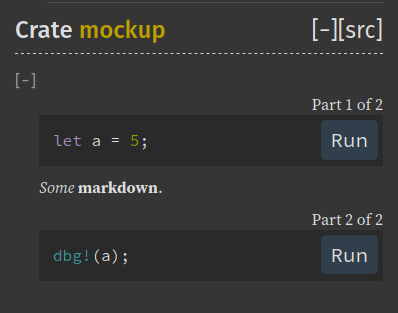
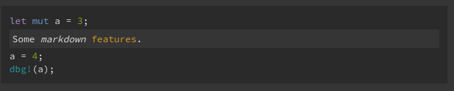

- Feature Name: Multi-part examples in rustdoc
- Start Date: 2021-02-09
- RFC PR: [rust-lang/rfcs#3081](https://github.com/rust-lang/rfcs/pull/3081)
- Rust Issue: [rust-lang/rust#0000](https://github.com/rust-lang/rust/issues/0000)

# Summary
[summary]: #summary

Support for multi-part examples in rustdoc, which consists of:
  1. Running them as doc-tests
  2. UI indicating members of multi-part examples in rendered docs

# Motivation
[motivation]: #motivation

A long example often calls for lines of explanatory text interleaved within it.

Currently, there are three means of achieving this:

1. Use rust comments inside the long example.
  Downsides:
    1. No markdown
    2. If a comment overflows the rendered code block horizontally, scrolling is possible, yet cumbersome, especially when the comment is far from the bottom, where the scroll bar happens to be.
2. Split long examples into multiple code blocks and add the text between them.
  Downsides:
    1. Must disable doc-test-ing the example
    2. Lack of UI indicating that the code blocks are multiple parts of a whole
3. Duplicate the example code in each part and hide, using [the `#` feature][hiding-portions], different lines in each example.
  There's an example of this in the link above.
  Downsides:
    1. Tedious. Macros may make this easier, but still not convenient.

This RFC suggests a new feature in rustdoc that supports multi-part examples without any of the downsides listed above.

# Guide-level explanation
[guide-level-explanation]: #guide-level-explanation

## Multi-part examples

A long example may benefit from being split up into multiple code blocks. The rendered documentation will indicate that each code block is a part of a whole. Also, doc-tests, run links, etc. will work as expected.

The first block of a multi-part example must be tagged with `split-start`.
Zero or more continuation blocks tagged with `split-continue` may follow.
A final `split-end` block must be present.
Between parts, any markdown may appear, including code blocks.
However, no interleaving or nesting of multi-part examples is allowed.

Example:

    //! ```split-start
    //! let mut a = 5;
    //! ```
    //! 
    //! We have declared a _mutable_ variable `a` of type `i32`.
    //! 
    //! ```split-continue
    //! a = 10;
    //! ```
    //!
    //! We have reassigned `a`. Now, let's look at the value:
    //!
    //! ```split-end
    //! dbg!(a);
    //! ```

Doc-test related tags, such as `ignore` and `no-run` must be specified only on `split-start` blocks.

If a language tag is present, it must be the first word in the info-string and must be present in all parts of the multi-part example.

If `split-start` / `split-continue` / `split-end` blocks appear in an erroneous order, the documentation will fail to build.

# Reference-level explanation
[reference-level-explanation]: #reference-level-explanation

UI Mockup:



> This is the technical portion of the RFC. Explain the design in sufficient detail that:
>
> - Its interaction with other features is clear.

- Interaction with doc-test related tags seems to be fully explained in the previous section.

> - It is reasonably clear how the feature would be implemented.

We are not familiar with the code base.

TODO:
- Doc-tests details such as line numbers and test names
- Ordering / nesting / interleaving errors details
- Inconsistent langauge error details
- Details of interaction with langauge tags

We would like some more feedback before continuing with greater detail.

# Drawbacks
[drawbacks]: #drawbacks

## New code and possible complexity

This feature would introduce some amount of new code. We are not familiar with the code base to determine whether the complexity of the architecture must be increased.

## Using non-standard markdown

This feature adds some new rust-specific tags to markdown code blocks. Markdown itself would not be aware of this feature. Therefore, markdown tools would not be aware of it. For example, after a long code example is broken into multiple parts, an IDE will not see a complete code example, unless it supports this feature. If the documentation author cares about this, then they don't have to use this feature.

# Rationale and alternatives
[rationale-and-alternatives]: #rationale-and-alternatives

## Why not an implicit `split-continue`?

We have considered the possibility of the `split-continue` tag either being implicit and therefore possibly omitted or not having such a tag at all.
Every code block between a `split-start` and a `split-end` would be considered another part of the multi-part example.
The problem with this design is that without further syntax, it disallows having unrelated code blocks in between multi-part example code blocks.
For example, if between the `split-start` and `split-end` of a multi-part example, the author wishes to insert a `text` code block—that shows input/output or example data—this would either not be permitted or it will be made possible with some additional logic.
Both _not permitting_ such nested single-part examples and _additional logic_ for permitting them seems less elegant/desirable than the simpler approach of requiring explicit `split-continue` tags.

## Why error on inconsistent language tags

From the guide section earlier:

> If a language tag is present, it must be the first word in the info-string and must be present in all parts of the multi-part example.

An alternative to this is that specifying the language in the `split-start` block suffices and rustdoc can understand that all following parts of the multi-part example are of the same language.
There is a problem with that.
Pure markdown doesn't know and will never know anything about this feature.
Markdown only [acknowledges][commonmark-fenced] the _typical_ use of the first word to specify a language:

> The first word of the info string is typically used to specify the language of the code sample, and rendered in the class attribute of the code tag. However, this spec does not mandate any particular treatment of the info string.

So any tools that are not rust-specific (or that don't yet implement multi-part examples) would not have the same understanding of this feature as rustdoc will, and therefore will think that only the first code block is whatever language was specified and the rest of the code blocks are not necessarily the same language.

Erroring when the language tag varies between parts of a multi-part example prevents this situation.

At the very least, it would probably prevent some authors from a future moment where they would think to themselves "oh, darn — I wish _I had_ placed the `ruby` tag on _every part_ of the multi-part example".

Since the majority of multi-part examples are expected to be rust code, where the `rust` langauge tag is usually omitted, this error is not expected to be common.

## Alternative design: rendered markdown_comments

Example:

    ```markdown_comments
    let mut a = 3;
    // Some _markdown_ [features](https://example.com/markdown_features).
    a = 4;
    dbg(a)
    ```

Rendered into something like this:



The proposed `markdown_comments` tag would enable the feature in a code block.
Then, any comments inside that block would be treated as markdown and rendered as HTML inside a container that is nested inside the code block, between the lines of code, where it is placed. These comments would no longer appear as comments inside the code, but as a block element with clear visual cues separating it from code.
Rendered, they will not begin with `//`, etc.

Drawbacks:

- Already, a rust code example is typically a nested embedding:
  a rust file; in which there's a markdown comment; in which there's a rust code block.
  This proposal would add another layer of nesting to this.
  Another layer of nesting would incur mental overhead and increased implementation cost for tooling compared with the suggested approach.
- For longer nested comments, might be cumbersome.
  Imagine comments that include code blocks. That's another nesting. Imagine long text. You'd have to handle line breaks and comment slashes (`//`).
- [According to @jyn514](https://github.com/rust-lang/rfcs/pull/3081#discussion_r577914359), this would be very difficult to implement.

Advantages:

- Seems rather futuristic and perhaps could be part of a larger langauge change, where all comments are by definition markdown, and therefore GUI editors could display rendered versions of comments in place of the actual comments.
- There's no splitting of code blocks.

We imagine a more convenient authoring experience with the suggested design.
Even though it feels like a close call, that tips the scale.

Also, the suggested approach is not mutually exclusive with this approach, so that this approach could remain a future possibility.

## Tree variant

This design is similar to the suggested design, but blocks may form tree structures. Multiple blocks may continue from a same prior block.

The advantage is that it would allow code sharing between multiple examples.

The disadvantage is that the result might not be reader-friendly.
Documentation is pages that are consumed usually top to bottom.
Adding code blocks that continue one another in some tree structure may seem like a good idea from the perspective of the developer/author but would probably not actually be nice for the reader.

## Interleaved variant

This is a feature that is additional to the suggested design, where the blocks of a multi-part example may interleave with blocks of other multi-part examples.

We feel that this could lead to confusing documentation.

## Q: What is the impact of not doing this?

If this feature is not implemented and no other solution is implemented for including text in long code examples, then long code examples in rust documentation continue to be inconvenient for both authors and readers.

# Prior art
[prior-art]: #prior-art

This RFC is the evolution of a comment analyzing the existing [RFC 2894][rfc_2894]. It follows [this comment][rfc_comment].

If we look at how programming books are commonly formatted, we will often find multi-part code examples.
They are split into multiple code blocks and continue each other linearly.
Between the code blocks is usually verbose educational text.
Rust documentation authors already seem to follow this style while using one or more of the workarounds described earlier.
This RFC officialy adopts this style.

One could claim that this RFC allows code examples to be written in [literate programming][literate_programming] style.

We are not aware of a similar feature in any other language.
If anyone is, then please let us know.

# Unresolved questions
[unresolved-questions]: #unresolved-questions

We have some todos in the spec section.
Otherwise, none that we could think of.

# Future possibilities
[future-possibilities]: #future-possibilities

One future possibility is that code editors would recognize multi-part examples and enable language features such as refactoring across the multiple parts as a whole.
Assuming, of course, that they would support language features inside of code examples in documentation, at all.

We expect the release of this feature into stable to improve the overall experience of documenting non-trivial crates.

[hiding-portions]: https://doc.rust-lang.org/rustdoc/documentation-tests.html#hiding-portions-of-the-example
[rfc_2894]: https://github.com/rust-lang/rfcs/pull/2894
[rfc_comment]: https://github.com/rust-lang/rfcs/pull/2894#issuecomment-773913220
[literate_programming]: https://en.wikipedia.org/wiki/Literate_programming
[commonmark-fenced]: https://spec.commonmark.org/0.29/#fenced-code-blocks
