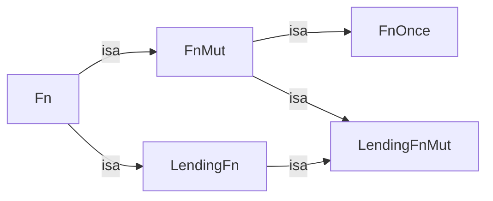

- Feature Name: `async_closure`[^rework][^plural]
[^rework]: This RFC reworks the "async closures" section of [RFC 2394]
[^plural]: The original feature name was not pluralized, and though it'd be more correct in the plural, it's probably too late to change at this point.
- Start Date: 2024-06-25
- RFC PR: [rust-lang/rfcs#3668](https://github.com/rust-lang/rfcs/pull/3668)
- Tracking Issue: [rust-lang/rust#62290](https://github.com/rust-lang/rust/issues/62290)

[RFC 2394]: https://rust-lang.github.io/rfcs/2394-async_await.html#async--closures

# Summary
[summary]: #summary

This RFC adds an `async` bound modifier to the `Fn` family of trait bounds.  The combination desugars to a set of unstable `AsyncFn{,Mut,Once}` traits that parallel the current `Fn{,Mut,Once}` traits.

These traits give users the ability to express bounds for async callable types that are higher-ranked, and allow async closures to return futures which borrow from the closure's captures.

This RFC also connects these traits to the `async || {}` closure syntax, as originally laid out in [RFC 2394][], and confirms the necessity of a first-class async closure syntax.

[RFC 2394]: (https://rust-lang.github.io/rfcs/2394-async_await.html#async--closures)

# Motivation
[motivation]: #motivation

Users hit two major pitfalls when writing async code that uses closures and `Fn` trait bounds:

- The inability to express higher-ranked async function signatures.
- That closures cannot return futures that borrow from the closure captures.

We'll discuss each of these in the sections below.

### Inability to express higher-ranked async function signatures

Users often employ `Fn()` trait bounds to write more functional code and reduce code duplication by pulling out specific logic into callbacks. When adapting these idioms into async Rust, users find that they need to split their `Fn()` trait bounds[^alloc] into two to account for the fact that `async` blocks and async functions return anonymous futures.  E.g.:
[^alloc]: Or return a concrete future type, like `F: Fn() -> Pin<Box<dyn Future<Output = T>>>`.

```rust
async fn for_each_city<F, Fut>(mut f: F)
where
    F: for<'c> FnMut(&'c str) -> Fut,
    Fut: Future<Output = ()>,
{
    for x in ["New York", "London", "Tokyo"] {
        f(x).await;
    }
}
```

However, when they try to call this code, users are often hit with mysterious higher-ranked lifetime errors, e.g.:

```rust
async fn do_something(city_name: &str) { todo!() }

async fn main() {
    for_each_city(do_something).await;
}
```

```
error: implementation of `FnMut` is not general enough
  --> src/main.rs
   |
   |     for_each_city(do_something);
   |     ^^^^^^^^^^^^^^^^^^^^^^^^^^^ implementation of `FnMut` is not general enough
   |
   = note: `for<'a> fn(&'a str) -> impl Future<Output = ()> {do_something}` must implement `FnMut<(&str,)>`
   = note: ...but it actually implements `FnMut<(&'0 str,)>`, for some specific lifetime `'0`
```

This happens because the type for the `Fut` generic parameter is chosen by the caller, in `main`, and it cannot reference the higher-ranked lifetime `for<'c>` in the `FnMut` trait bound, but the anonymous future produced by calling `do_something` does capture a generic lifetime parameter, and *must* capture it in order to use the `&str` argument.

### Closures cannot return futures that borrow from their captures

When users wants to *call* a function that takes an async callback argument, they often reach for `|| async {}` (a closure that returns an anonymous future) because closures can capture state from the local environment and are syntactically lightweight.

However, users are quickly met with the limitation that they cannot use any of the closure's captures by reference in the async block.  E.g.:

```rust
async fn parent_country(city_name: &str) -> String { todo!() }

async fn main() {
    // Collect the country names of each city in our list.
    let mut countries = vec![];
    for_each_city(|city_name| async {
        countries.push(parent_country(city_name).await);
    })
}
```

```
error: captured variable cannot escape `FnMut` closure body
  --> src/main.rs
   |
   |       let mut countries = vec![];
   |           ------------- variable defined here
   |       for_each_city(|city_name| async {
   |  _____________________________-_^
   | |                             |
   | |                             inferred to be a `FnMut` closure
   | |         countries.push(parent_country(city_name).await);
   | |         --------- variable captured here
   | |     }).await;
   | |_____^ returns an `async` block that contains a reference to a captured variable, which then escapes the closure body
   |
   = note: `FnMut` closures only have access to their captured variables while they are executing...
   = note: ...therefore, they cannot allow references to captured variables to escape
```

The future that is returned by the closure cannot reference any of the captures of the closure, which is a limitation that makes `|| async {}` quite unusable today without needing to, for example, clone data and declare the async block `move`.

In order for this to work, the `FnMut` trait would need to be ["lending"](https://smallcultfollowing.com/babysteps/blog/2023/05/09/giving-lending-and-async-closures/#async-closures-are-a-lending-pattern); however, there are [complications](https://hackmd.io/@compiler-errors/async-closures#Lending-closures-are-not-typically-FnOnce) with implementing general lending closures.

# Guide Level Explanation

Just as you can write functions which accept closures, you can write functions which accept async closures:

```rust
async fn takes_async_closure(f: impl async Fn(u64)) {
    f(0).await;
    f(1).await;
}

takes_async_closure(async |i| {
    core::future::ready(i).await;
    println!("done with {i}.");
});
```

We recommend using `async Fn()`/`async FnMut()`/`async FnOnce()` and `async ||` for async closures. This is more flexible than a closure returning a future for the reasons described elsewhere in this RFC.

Async closures act similarly to closures, and can have parts of their their signatures specified:

```rust
// They can have arguments annotated with types:
let arg = async |x: i32| { async_add(x, 1).await };

// They can have their return types annotated:
let ret = async || -> Vec<Id> { async_iterator.collect().await };

// They can be higher-ranked:
let hr = async |x: &str| { do_something(x).await };
```

When called, they return an anonymous future type corresponding to the (not-yet-executed) body of the closure. These can be awaited like any other future.

The `async Fn` trait bound syntax can be used anywhere a trait bound is allowed, such as:

```rust
/// In return-position impl trait:
fn closure() -> impl async Fn() { async || {} }

/// In trait bounds:
trait Foo<F>: Sized
where
    F: async Fn()
{
    fn new(f: F) -> Self;
}

/// in GATs:
trait Gat {
    type AsyncHasher<T>: async Fn(T) -> i32;
}
```

# Detailed Explanation

### `AsyncFn*`

This RFC introduces a family of `AsyncFn` traits. These traits are intended to remain unstable to name or implement, just like the `Fn` traits. Nonetheless, we'll describe the details of these traits so as to explain the user-facing features enabled by them.

The definition of the traits is (modulo `rustc_` attributes, and the `"rust-call"` ABI):


> [!NOTE]
> We omit some details about the `"rust-call"` calling convention and the fact that the `Args` parameter is enforced to be a tuple.

```rust
/// An async-aware version of the [`FnOnce`](crate::ops::FnOnce) trait.
///
/// All `async fn` and functions returning futures implement this trait.
pub trait AsyncFnOnce<Args> {
    /// Future returned by [`AsyncFnOnce::async_call_once`].
    type CallOnceFuture: Future<Output = Self::Output>;

    /// Output type of the called closure's future.
    type Output;

    /// Call the [`AsyncFnOnce`], returning a future which may move out of the called closure.
    fn async_call_once(self, args: Args) -> Self::CallOnceFuture;
}

/// An async-aware version of the [`FnMut`](crate::ops::FnMut) trait.
///
/// All `async fn` and functions returning futures implement this trait.
pub trait AsyncFnMut<Args>: AsyncFnOnce<Args> {
    /// Future returned by [`AsyncFnMut::async_call_mut`] and [`AsyncFn::async_call`].
    type CallRefFuture<'a>: Future<Output = Self::Output>
    where
        Self: 'a;

    /// Call the [`AsyncFnMut`], returning a future which may borrow from the called closure.
    fn async_call_mut(&mut self, args: Args) -> Self::CallRefFuture<'_>;
}

/// An async-aware version of the [`Fn`](crate::ops::Fn) trait.
///
/// All `async fn` and functions returning futures implement this trait.
pub trait AsyncFn<Args>: AsyncFnMut<Args> {
    /// Call the [`AsyncFn`], returning a future which may borrow from the called closure.
    fn async_call(&self, args: Args) -> Self::CallRefFuture<'_>;
}
```

### Associated types of `AsyncFn*` traits are not nameable

Unlike what is true today with the current `Fn*` traits, this RFC reserves as an implementation detail the associated types of the `AsyncFn*` traits, and these will not be nameable as part of the stable interface specified by this RFC.

That is, using the existing `FnOnce` trait, we can write this today on stable Rust:

```rust
fn foo<F, T>()
where
    F: FnOnce() -> T,
    F::Output: Send, //~ OK
{
}
```

(We decided to allow this in [#34365](https://github.com/rust-lang/rust/pull/34365).)

However, this RFC reserves as an implementation detail the associated types of the traits specified above, so this does not work:

```rust
fn foo<F, T>()
where
    F: async FnOnce() -> T,
    F::Output: Send,
    //~^ ERROR use of unstable library feature
    F::CallOnceFuture: Send,
    //~^ ERROR use of unstable library feature
{
}
```

### `async` bound modifier on `Fn()` trait bounds

The `AsyncFn*` traits specified above are nameable via a new `async` bound modifier that is allowed on `Fn` trait bounds. That is, `async Fn*() -> T` desugars to `AsyncFn*() -> T` in bounds, where `Fn*` is one of the three flavors of existing function traits: `Fn`/`FnMut`/`FnOnce`.

This RFC specifies the modification to the _TraitBound_ nonterminal in the grammar:

> **<sup>Syntax</sup>**
> _TraitBound_ :
> &nbsp;&nbsp;&nbsp;&nbsp;`async`<sup>?</sup> `?`<sup>?</sup> _ForLifetimes_<sup>?</sup> _TypePath_\
> &nbsp;&nbsp;| `(` `async`<sup>?</sup> `?`<sup>?</sup> _ForLifetimes_<sup>?</sup> _TypePath_ `)`

**note**: The grammar specifies that any `for<'a>` higher-ranked lifetimes come *after* the `?` trait polarity. This seems inconsistent, but should be changed independently from this RFC. There's an open question about how to deal with the ordering problem of `?`, `for<'a>`, and `async`, or we want to separate `async` traits into their own production rule.

Since the grammar doesn't distinguish parenthesized and angle-bracketed generics in `_TypePath_`, `async` as a trait bound modifier will be **accepted** in all trait bounds at _parsing_ time, but it will be **denied** by the compiler _post-expansion_ if it's not attached to a parenthesized `Fn()` trait bound.

Users are able to write `async Fn*() -> T` trait bounds in all positions that trait bounds are allowed, for example:

```rust
fn test(f: F) where F: async Fn() -> i32 {}

fn apit(f: impl async Fn() -> i32) {}

trait Tr {
    type Callable: async Fn() -> i32;
}

// Allowed syntactically; not currently object-safe:
let _: Box<dyn async Fn()> = todo!();
```

### When is `async Fn*()` implemented?

All currently-stable callable types (i.e., closures, function items, function pointers, and `dyn Fn*` trait objects) automatically implement `async Fn*() -> T` if they implement `Fn*() -> Fut` for some output type `Fut`, and `Fut` implements `Future<Output = T>`.

This is to make sure that `async Fn*()` trait bounds have maximum compatibility with existing callable types which return futures, such as async function items and closures which return boxed futures. Async closures also implement `async Fn*()`, but their relationship to this trait is detailed later in the RFC.

These implementations are built-in, but can conceptually be understood as:

```rust
impl<F, Args, Fut, T> AsyncFnOnce<Args> for F
where
    F: FnOnce<A, Output = Fut>,
    Fut: Future<Output = T>,
{
    type Output = T;
    type CallOnceFuture = Fut;

    fn async_call_once(self, args: Args) -> Self::CallOnceFuture {
        FnOnce::call_once(self, args)
    }
}
```

And similarly for `AsyncFnMut` and `AsyncFn`, with the appropriate `FnMut` and `Fn` trait bounds, respectively.

**NOTE**: This only works currently for *concrete* callable types -- for example, `impl Fn() -> impl Future<Output = ()>` does not implement `impl async Fn()`, due to the fact that these blanket impls do not exist in reality. This may be relaxed in the future. Users can work around this by wrapping their type in an async closure and calling it.

The reason that these implementations are built-in is because using blanket impls would cause overlap with the built-in implementation of `AsyncFn*` for async closures, which must have a distinct implementation to support self-borrowing futures.

Some stable types that implement `async Fn()` today include, e.g.:

```rust!
// Async functions:
async fn foo() {}

// Functions that return a concrete future type:
fn foo() -> Pin<Box<dyn Future<Output = ()>>> { Box::pin(async {}) }

// Closures that return an async block:
let c = || async {};
```

Notably, we can now express higher-ranked async callback bounds:

```rust
// We could also use APIT: `mut f: impl async FnMut(&str)`.
async fn for_each_city<F>(mut f: F)
where
    F: async FnMut(&str),
//     ...which is sugar for:
//  F: for<'a> async FnMut(&'a str),
{
    for x in ["New York", "London", "Tokyo"] {
        f(x).await;
    }
}

async fn increment_city_population_db_query(city_name: &str) { todo!() }

async fn main() {
    // Works for `async fn` that is higher-ranked.
    for_each_city(increment_city_population_db_query).await;
}
```

### Async closures

Async closures were first specified in [RFC 2394][]. This RFC doesn't affect them syntactically, but it does lay out new rules for how they interact with `AsyncFn*` traits.

Like async functions, async closures return futures which execute the code in the body of the closure. Like closures, they are allowed to capture variables from the surrounding environment if they are mentioned in the body of the closure. Each variable is captured in the most permissive capture mode allowed, and this capture analysis generally follows the same rules as closures, including allowing disjoint captures per [RFC 2229](https://rust-lang.github.io/rfcs/2229-capture-disjoint-fields.html).

#### Async closures allow self-borrows

However, since async closures return a future instead of executing their bodies directly, the future corresponding to the body must *itself* capture all of the closure's captures. These are captured with the most permissive capture mode allowed, which (unless the captures are being consumed by-value) necessitates borrowing from the closure itself.

For example:

```rust
let vec: Vec<String> = vec![];

let closure = async || {
    vec.push(ready(String::from("")).await);
};
```

The closure captures `vec` with some `&'closure mut Vec<String>` which lives until the closure is dropped. Then every call to the closure reborrows that mutable reference `&'call Vec<String>` which lives until the future is dropped (e.g. `await`ed).

As another example:

```rust!
let string: String = "Hello, world".into();

let closure = async move || {
    ready(&string).await;
};
```

The closure is marked with `move`, which means it takes ownership of the string by *value*. However, if the future also took ownership of the string *from* the closure, then the closure would only be callable once. This is not a problem, since according to the usage of `string` in the closure body, the future only needs take a reference to it to call `ready`. Therefore, the future captures `&'call String` for some lifetime which lives until the future is dropped.

#### Closure kind analysis

Similarly to regular closures, async closures always implement `AsyncFnOnce`. They additionally implement `AsyncFnMut` if they do not move any of their captured values, and `AsyncFn` if they additionally do not mutate their captured values.

Async closures unconditionally implement the (non-async) `FnOnce` trait. They implement `FnMut` and `Fn` if they do not move their captured values, mutate them, or borrow in the future any data from the closure. The future borrows data from the closure if the data being borrowed by the future is owned or if the borrow is mutable.

For example:

```rust
let s = String::from("hello, world");
// Implements `async Fn()` along with `FnMut` and `Fn`
// because it can copy the `&String` that it captures.
let _ = async || {
    println!("{s}");
};

let s = String::from("hello, world");
// Implements `async Fn()` but not `FnMut` or `Fn` because
// it moves and owns a value of type `String`, and therefore
// the future it returns needs to take a pointer to data
// owned by the closure.
let _ = async move || {
    println!("{s}");
};

let mut s = String::from("hello, world");
// Implements `async FnMut()` but not `FnMut` or `Fn`
// because it needs to reborrow a mutable pointer to `s`.
let _ = async move || {
    s.push('!');
};
```

#### Specifics about the `AsyncFnOnce` implementation, interaction with `move`

If the closure is inferred to be `async Fn` or `async FnMut`, then the compiler will synthesize an `async FnOnce` implementation for the closure which returns a future that doesn't borrow any captured values from the closure, but instead *moves* the captured values into the future.

For example:

```rust
let s = String::from("hello, world");

let closure = async move || {
    ready(&s);
};
// At this point, `s` is moved out of.  However, the
// allocation for `s` is still live.  It just lives as a
// captured field in `closure`.

// Manually call `AsyncFnOnce` -- this isn't stable since
// `AsyncFnOnce` isn't stable, but it's useful for the demo.
let fut = AsyncFnOnce::call_once(closure, ());
// At this point, `closure` is dropped.  However, the
// allocation for `s` is still live.  It now lives as a
// captured field in `fut`.

fut.await;
// After the future is awaited, it's dropped.  At that
// point, the allocation for `s` is dropped.
```

### Interaction with return-type notation, naming the future returned by calling

With `async Fn() -> T` trait bounds, we don't know anything about the `Future` returned by calling the async closure other than that it's a `Future` and awaiting that future returns `T`.

This is not always sufficient, for example, if you want to spawn a future onto another thread:

```rust
async fn foo(x: impl async Fn(&str)) -> Result<()> {
    tokio::spawn(x("hello, world")).await
}
```

```
error[E0277]: cannot be sent between threads safely
   --> src/lib.rs
    |
    |     tokio::spawn(x("hello, world")).await
    |     ------------ ^^^^^^^^^^^^^^^^^ cannot be sent between threads safely
    |     |
    |     required by a bound introduced by this call
```

With the acceptance of the RTN (return-type notation) [RFC 3654](https://github.com/rust-lang/rfcs/pull/3654), this RFC specifies that users will be allowed to add RTN-like bounds to type parameters that are also bounded by `async Fn()`. Concretely, this bound expands to bound both `CallOnceFuture` and `CallRefFuture` (if the latter exists):

```rust
async fn foo(x: F) -> Result<()>
where
    F: async Fn(&str) -> Result<()>,
    // The future from calling `F` is `Send` and `'static`.
    F(..): Send + 'static,
    // Which expands to two bounds:
    // `for<'a> <F as AsyncFnMut>::CallRefFuture<'a>: Send`
    // `<F as AsyncFnOnce>::CallOnceFuture: Send`
    // the latter is only if `F` is bounded with `async Fn` or `async FnMut`.
{
    tokio::spawn(x("hello, world")).await
}
```

This bound is only valid if there is a corresponding `async Fn*()` trait bound.

# Rationale and alternatives
[rationale-and-alternatives]: #rationale-and-alternatives

### Why do we need a new set of `AsyncFn*` traits?

As demonstrated in the motivation section, we need a set of traits that are *lending* in order to represent futures which borrow from the closure's captures. We technically only need to add `LendingFn` and `LendingFnMut` to our lattice of `Fn*` traits, leaving us with a hierarchy of traits like so:



However, there are some concrete technical implementation details that limit our ability to use `LendingFn` ergonomically in the compiler today. These have to do with:

- Closure signature inference.
- Limitations around higher-ranked trait bounds.
- Shortcomings with error messages.

These limitations, plus the fact that the underlying trait should have no effect on the user experience of async closures and async `Fn` trait bounds, leads us to `AsyncFn*` for now. To ensure we can eventually move to these more general traits, we reserved the precise `AsyncFn*` trait definitions (including the associated types) as an implementation detail.

### Why can't we just use `|| async {}`?

`async ||` is analogous with `async fn`, and has an intuitive, first-class way to declare the return type of the future:

```rust!
let c = async || -> i32 { 0 };
```

There isn't currently a way to annotate the future's return type in a closure that returns a future:

```rust!
let c = || -> /* ??? */ async { 0 };
```

We could reuse `impl Future` to give users the ability to annotate the type of the future returned by the closure this position, but it would require giving yet another subtly different meaning to `impl Trait`, since async closures return a *different* type when being called by-ref or by-move.

This also would have subtle limitations, e.g.:

```rust!
// Easy to reanalyze as an async closure.
let _ = || async { do_stuff().await };

// Not possible to reanalyze as an async closure without a lot more work.
let _ = || {
    let fut = async { do_stuff().await };
    fut
};
```

### Why not `F: AsyncFn() -> T`, naming `AsyncFn*` directly?

Reusing the `async` keyword allows users to understand what an `async Fn() -> T` trait bound does by analogy, since they already should know that adding `async` to some `fn foo() -> T` makes it return an `impl Future<Output = T>` instead of the type `T`.

### Why do we even need `AsyncFnOnce`?

We could desugar `async FnOnce() -> T` directly to `FnOnce<(), Output: Future<Output = T>>`. It seems overly complicated for an implementation detail, since users should never care what's *behind* the `AsyncFnOnce` trait bound.

# Drawbacks
[drawbacks]: #drawbacks

### Users might confusedly write `|| async {}` over `async || {}`

Users may be confused whether to write `|| async {}` or `async || {}`. The fact that `async || {}` has extra "superpowers" with respect to lending may lead to users hitting unnecessary errors if they invert the ordering.

We should be able to detect when users write `|| async {}` -- and subsequently hit borrow checker issues -- and give a useful error message to move the `async` keyword. We may also lint against `|| async {}` in code that *does* pass, since it's not as expressive.

### Users might write `F: Fn() -> Fut, Fut: Future<Output = T>` over `F: async Fn() -> T`

A similar problem could occur if users try to write "old style" trait bounds with two generic parameters `F: Fn() -> Fut` and `Fut: Future<Output = T>`.  For example:

```rust!
async fn for_each_city<F, Fut>(cb: F)
where
    F: Fn(&str) -> Fut,
    Fut: Future<Output = ()>,
{
    for x in ["New York", "London", "Tokyo"] {
        cb(x).await;
    }
}
```

This is problematic for two reasons:

1. Although the `Fn` trait bound may be higher-ranked, the future that is returned cannot be, since we need to infer a single type parameter substitution for the `Future` bound to hold.
2. There's no way for an async closure to be lending in this case, so the expressivity of the closure is limited.

We can similarly implement a lint to detect cases where users write these two-part bounds and suggest that they instead write a single `async Fn() -> T` bound. This comes with the normal caveats of removing a type parameter from the function signature, e.g. semver incompatibility (since the type parameter may be turbofished). However, when users are designing a new API, they should always reach for `async Fn` trait bounds when they want to be generic over a closure that returns a future.

### Lack of a desugaring

It's not possible to directly name the future returned by calling some generic `T: async Fn()`. This means that it's not possible, for example, to convert `futures-rs`'s [`StreamExt::then` combinator](https://docs.rs/futures/0.3.30/futures/stream/trait.StreamExt.html#method.then), since the output future is referenced in the definition of [`Then`](https://docs.rs/futures-util/0.3.30/src/futures_util/stream/stream/then.rs.html#19) returned by the combinator.

Fixing this is a follow-up goal that we're interested in pursuing in the near future.

# Prior art
[prior-art]: #prior-art

[RFC 2394] described async closures at a very high level, and expressed that users would very likely want this feature eventually. This RFC confirms that suspicion.

# Unresolved questions
[unresolved-questions]: #unresolved-questions

### `? for<'a>` and its interaction with `async`

Currently on nightly, we parse the `async` trait bound modifier along with `?` (called polarity) *before* the `for<'a>` lifetime binders. This probably should get fixed so that the binder occurs on the *outside* of the trait, like so:

```
where T: for<'a> async ?Trait
```

(Which is semantically invalid but syntactically valid.) This is currently proposed in [rust-lang/rust#127054](https://github.com/rust-lang/rust/pull/127054), which should be decided before stabilization, and the stabilization report can re-confirm the correct ordering of `for<'a>` and `async`.

# Future possibilities
[future-possibilities]: #future-possibilities

### `gen Fn()`, `async gen Fn()`

The existence of other coroutine-like modifiers, e.g. `gen` ([RFC 3513](https://rust-lang.github.io/rfcs/3513-gen-blocks.html)) and `async gen`, suggests that we should also think about supporting these in closures and `Fn()` trait bounds.

This shouldn't be too difficult to support, and we can unify these further by moving on to a general `LendingFn*` trait. This has some implementation concerns, but should be doable in the long term.

### `async` bound modifier on arbitrary traits

There has been previous discussion of allowing `async` trait bounds on arbitrary traits, possibly based off a `?async` maybe-async genericity system.

This RFC neither requires this more general extension to the language to be implemented, nor does it necessarily preclude this being an eventual possibility, since `AsyncFn*` remains unstable to implement.

### Making `async Fn()` object-safe

Future work should be done to make `async Fn()` object-safe, so it can be used in `Box`, etc.  E.g.:

```rust
let handlers: HashMap<Id, Box<dyn async Fn()>> = todo!();
```

This work will likely take a similar approach to making `async fn` in traits object-safe, since the major problem is how to "erase" the future returned by the async closure or callable, which differs for each implementation of the trait.
