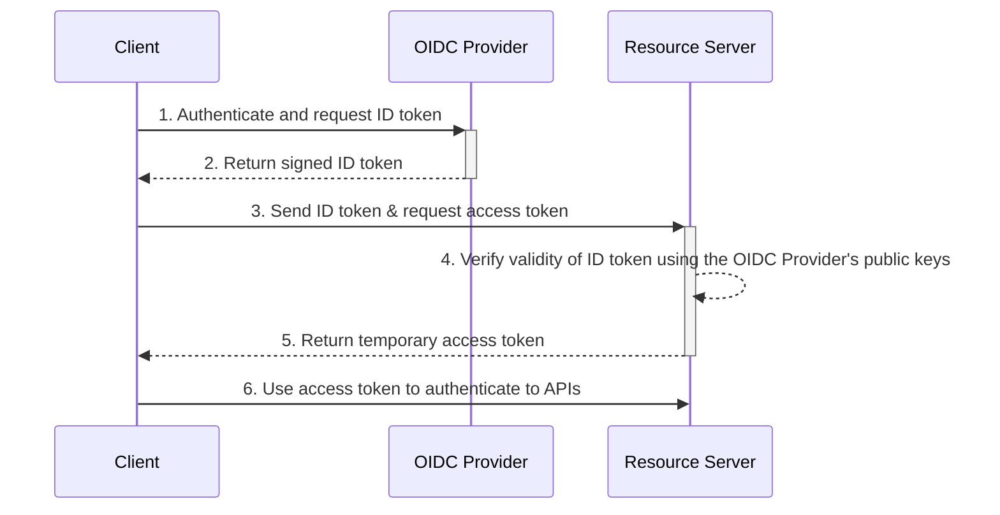
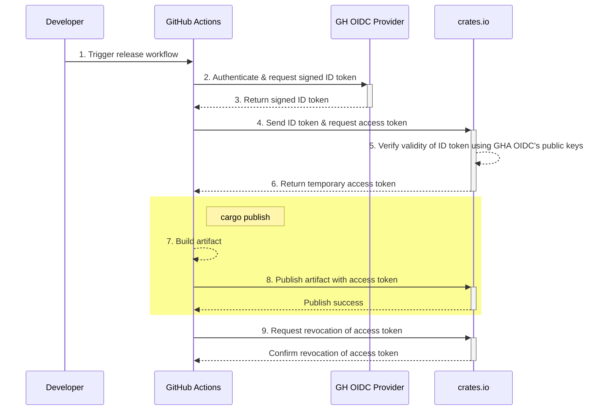

# Security Improvements for CI Publishing to crates.io

- Feature Name: crates-io-trusted-publishing
- Start Date: 2024-09-10
- RFC PR: [rust-lang/rfcs#3691](https://github.com/rust-lang/rfcs/pull/3691)

## Summary
[summary]: #summary

This RFC proposes adding support for ["trusted publishing"](https://blog.trailofbits.com/2023/05/23/trusted-publishing-a-new-benchmark-for-packaging-security/) to crates.io. Short-lived access tokens are granted via the [OpenID Connect (OIDC) protocol](https://openid.net/connect/) to authenticate and authorize actions with the crates.io APIs.

The term "trusted publishing" here refers to the publishing of crates from a trusted CI/CD system, for example GitHub Actions (GHA), without the use of a manually configured API token. Instead, an access token typically valid for less than an hour is created via OIDC flows and used to authenticate to crates.io.

> [!IMPORTANT]
> We will first implement trusted publishing for GitHub Actions as it will encompass the largest user base. 
> 
> After GitHub Actions, we will have a foundation and will be able to add support for other CI/CD trusted publishers including GitLab and [CircleCI](https://circleci.com/docs/openid-connect-tokens/).


## Motivation 
[motivation]: #motivation

Support for trusted publishing is used to strengthen the security posture around the supply chain of publishing Rust crates by _reducing the risk of credential leaks and streamlining release workflows_[^1]. Implementation of this would follow in [PyPI's footsteps](https://blog.pypi.org/posts/2023-04-20-introducing-trusted-publishers/) and align with [OpenSSF's Principles for Package Repository Security](https://repos.openssf.org/principles-for-package-repository-security#authorization).

Currently, crates.io only supports user-created API tokens used for either manual (i.e. running `cargo publish` from the developer machine) or automated publishing (i.e. via a CI/CD system). 

These tokens have some security flaws:

1. They can have no expiration (as of Sept 12 2024, they default to 90 days).
2. They can be used from any source without restriction.
    - For example, the same token can be used from a GitHub Actions workflow or from a personal workstation.
3. When using the tokens in automated workflows, they must be created in advance and copied by a human -- increasing the risk of accidental exposure.
4. Manually-configured API tokens need to be manually revoked if compromised.
    - The lag time between exposure and revocation provides more opportunity for abuse.
    - This introduces more manual, error prone steps during incident response.
    - GitHub's Secret Scanning does partially mitigate token exposures with [automatic detection and reporting to crates.io](https://github.blog/changelog/2023-01-19-the-crate-io-registry-is-now-a-github-secret-scanning-integrator/), but it's not a complete mitigation.

Our goal with trusted publishing is to mitigate and/or eliminate these risks.

In contrast to using a traditional API token from crates.io, [OIDC](https://docs.github.com/en/actions/deployment/security-hardening-your-deployments/about-security-hardening-with-openid-connect) and GitHub Actions will allow crate authors to:

1. Avoid any manual creation of an API token.
    - OIDC flows create an access token with a limited valid lifetime. For example, the access token may only be valid for 15 minutes after its creation.
2. Using OIDC's support for assertions and claims, access can be restricted to authorized sources
    - Claims can be associated to a specific GitHub organization, repository, workflow, and environment.
3. Instead of creating an API token, [a trusted publisher configuration](#trusted-publisher-configuration-cratesio) is used to authorize GitHub Action workflows from a particular organization, repository, workflow, and environment.
    - No credential is ever created or copied 


## Guide-level explanation
[guide-level-explanation]: #guide-level-explanation

### Terminology
[terminology]: #terminology

- **OpenID Connect**: [OpenID Connect](https://openid.net/developers/how-connect-works/) (or "OIDC") is a federated authentication protocol built on top of OAuth 2.0. OIDC allows unrelated third parties to make and verify cryptographically signed claims about identities.
- **OpenID Connect provider**: An OpenID Connect Provider (OIDC Provider or OIDC IdP) is a third-party service (such as GitHub Actions) that creates ID tokens attesting to identities within its purview. For example, GitHub Actions is the OIDC Provider for ID tokens corresponding to GitHub Actions workflows. An OIDC Provider both creates ID tokens and presents the public keys needed to verify them.
- **Relying Party (RP)**: This is the resource that depends on the OIDC IdP to authenticate users or machines. For example, crates.io would be the _relying party_ that depends on the GitHub Actions OIDC Provider to authenticate incoming _machines_ (i.e. a GHA workflow run).
- **Trusted Publisher**: A Trusted Publisher is a *specific* identity trusted to publish for a project on the package index. For example, if `github.com/example/repo/.github/workflows/release.yml` was registered to publish for `https://crates.io/crates/example`, we would say that the former is the latter's Trusted Publisher.
- **Identity token**: Typically referred to as an _ID token_. An ID token is a cryptographically signed representation of an identity (machine or human). In the context of OIDC and trusted publishing ID tokens are structured as JSON Web Tokens that represent the identity of a CI/CD workflow, such as `github.com/example/repo/.github/workflows/release.yml`.
- **Access Token**: In the context of OIDC, after an ID token is verified it can be exchanged for an access token. The access token is used as if it was an API token and actually permits access to perform API actions on crates.io. This exchange process is detailed below.
- **JSON Web Key Sets (JWKS)**: The public keys provided by the OIDC provider that the _relying party/resource servers_ use to verify the validity of a cryptographically signed ID token. Often found at the `/.well-known/jwks` URI path on the OIDC provider or in the `jwks_url` key of the `/.well-known/openid-configuration`.
- **Authentication (AuthN)**: Refers to the process of verifying someone or something is _who_ they say they are. This identity verification process can happen in many different ways, including but not limited to, a username/password combination, a shared secret, or even a biometric. 
- **Authorization (AuthZ)**: Refers to _what_ an authenticated user/machine can do. For example, they are allowed to _publish_ new crate versions on crates.io, but are not allowed to _yank_ existing crate versions.

<details>
    <summary>(Optional Read): Overview of OpenID Connect (OIDC)</summary>

### Overview of OpenID Connect (OIDC)
[overview-of-openid-connect]: #overview-of-openid-connect

We'll do our best here to give you a primer on OIDC and enough contextual information to assist in a solid understanding of this RFC. 

If you'd like more detail about OIDC here are some additional resources: 

- [How OpenID Connect Works](https://openid.net/developers/how-connect-works/)
- [OpenID Authentication 2.0 Specification](https://openid.net/specs/openid-authentication-2_0.html)
- OAuth 2.0 RFCs [6749](https://www.ietf.org/rfc/rfc6749.txt) and [6750](https://www.ietf.org/rfc/rfc6750.txt)
    - _OpenID is built on top of OAuth 2.0_
- [Using GitHub Action's OIDC Implementation](https://docs.github.com/en/actions/deployment/security-hardening-your-deployments/about-security-hardening-with-openid-connect)

A typical machine-to-machine OIDC flow will follow these steps:

1. The client machine will authenticate itself to the OIDC IdP and request an ID token.
2. The OIDC IdP, after authenticating the client, will issue a cryptographically signed ID token to be used to prove the client's identity.
3. The client will send the ID token to the _resource server_ (aka. _relying party_) to authenticate and request an _access token_.
4. The _resource server_ configured to outsource its authentication to the OIDC IdP will verify the cryptographic signature of the ID token using the IdP's public keys provided in its JSON Web Key Sets (JWKS).
5. Once verified, the resource server will create and respond with an _access token_ that can be used by the client.
6. The client uses the access token to access the resource server's APIs.



    
### GitHub Actions OIDC and crates.io
[oidc-flow-gha-cratesio]: #oid-flow-gha-cratesio

When publishing a new crate version to crates.io using GitHub Actions using OIDC authentication the participants include:

- The *client* is a particular run of a GitHub Action workflow.
- The *OIDC provider* is GitHub's own provider dedicated to GitHub Actions.
    - Their OpenID configuration can be found at https://token.actions.githubusercontent.com/.well-known/openid-configuration.
- The *resource server/relying party* is crates.io.

> [!NOTE]
> Crates.io would be configured by the crates.io Team to trust GitHub's OIDC provider using their configuration declared at [`.well-known/openid-configuration`](https://token.actions.githubusercontent.com/.well-known/openid-configuration).
>
> Practically, this means the crates.io server will periodically fetch the public keys needed to verify the validity of the cryptographically signed ID tokens.

A typical flow (after setting up a trusted publisher configuration) would follow these steps to publish a crate version on crates.io:



1. A developer, possibly after merging a pull request to their default branch, triggers a GitHub Actions release workflow.
    - The trigger of this workflow could be either manual or automatic depending on what's supported in the CI/CD system. Triggers that can be used to start a GitHub Action workflow can be found in [their documentation](https://docs.github.com/en/actions/using-workflows/events-that-trigger-workflows).
2. The GitHub Actions workflow requests an _ID token_ from the GitHub Action OIDC Provider.
    - For the workflow to be authorized to do this, [it needs `id-token: write` permissions declared in the workflow YAML](https://docs.github.com/en/actions/deployment/security-hardening-your-deployments/about-security-hardening-with-openid-connect#adding-permissions-settings).
3. After authenticating the workflow's request for an ID token, the GitHub Actions OIDC provider returns a cryptographically signed ID token (signed by its private key) .
4. The release workflow, sends the signed ID token to crates.io to exchange for an access token.
    - The ID token is not used to authorize any action on crates.io, it's only used to authenticate.
5. Crates.io, using the public keys of the GitHub Action OIDC Provider, validates the signature of the provided ID token that has been signed.
6. Once validated, crates.io generates a temporary access token and returns it to the Github Actions release workflow.
7. The release workflow builds the artifact to be published (i.e. [the `.crate` file](https://doc.rust-lang.org/cargo/commands/cargo-package.html))
8. The release workflow, using the access token retrieved from step 6, authenticates to crates.io and publishes the version of the crate.
9. As a good steward, once the crate has successfully been published, the workflow job will request the revocation of the access token from crates.io
    - An access token's lifetime might outlive the actual time needed to perform the action. It's good practice to revoke it once done to further limit any risks of accidental exposure. 

> [!NOTE]
> Steps 7 and 8 are abstracted in the `cargo publish` command. The access token would be passed via the `CARGO_REGISTRY_TOKEN` environment variable.
 
</details>

### Trusted Publisher Configuration on crates.io
[trusted-publisher-configuration-cratesio]: #trusted-publisher-configuration-cratesio

Prior to publishing a crate through a GitHub Actions workflow, the crate author will need to create a _Trusted Publisher Configuration_ via the crates.io web UI. This is a one-time configuration **required per crate**.

> [!Note]
> A _Trusted Publisher Configuration_ can only be created after an initial manual publishing of a crate.
> 
> See [Future Possibilities](#future-possibilities) for future plans to alleviate this pain.

Without a corresponding _Trusted Publisher Configuration_ any attempts from a GitHub Action workflow to exchange an ID token for an access token from crates.io will be unauthorized and fail. 

A _Trusted Publisher Configuration_ will vary on requirements depending on the trusted publisher being used (e.g. GitHub Actions, GitLab Pipelines, and so on). CI/CD providers will vary in the claims they make within their ID token. 

For GitHub Actions, the crate author will need to provide:

1. (required) The owning GitHub username or organization
2. (required) The repository name
3. (required) The workflow file name (must be located in `.github/workflows/`)
4. (optional) The [GitHub Actions environment](https://docs.github.com/en/actions/deployment/targeting-different-environments/using-environments-for-deployment) name

> [!Note]
> Supply chain compromises are still possible. As such, we are requiring the workflow file name to be defined in order to limit the attack surface. An attacker would need to compromise an action used specifically within the defined workflow file.
>
> It's recommended to thoroughly review any actions used in your release worfklow.

### Example GitHub Actions Workflow
[example-gha-workflow]: #example-gha-workflow

With a _Trusted Publisher Configuration_ in place, a example GitHub Actions workflow may look like this:

```yaml
name: Publish Crate

# Some may opt to use a trigger based on a push with a tag instead
on:
  release:
    types: [published]

jobs:
  build:
    runs-on: ubuntu-latest
    
    # here we use a GitHub Actions _Environment_ that allows for more 
    # control and steps to ensure security of the publishing 
    # process
    # 
    # See https://docs.github.com/en/actions/deployment/targeting-different-environments/using-environments-for-deployment
    environment: release

    permissions:
      id-token: write  # required in order to get a signed ID token
      contents: read

    steps:
    - name: Checkout code
      uses: actions/checkout@v4

    # The step below is not strictly required as `cargo publish`
    # will perform a build as well.
    - name: Install dependencies
      run: cargo build --release

    # This action does not exist currently.
    - name: Authenticate with crates.io
      id: auth
      uses: rust-lang/crates-io-auth-action@v1

    - name: Publish to crates.io
      run: cargo publish
      env:
        CARGO_REGISTRY_TOKEN: ${{ steps.auth.outputs.token }}

```

## Reference-level explanation
[reference-level-explanation]: #reference-level-explanation

### Required Configuration Parameters
[configuration]: #configuration

As stated in the [Trusted Publisher Configuration on crates.io](#trusted-publisher-configuration-cratesio) section, a configuration will need to provide:

1. (required) The owning GitHub username or organization
2. (required) The repository name
3. (required) The workflow file name (must be located in `.github/workflows/`)
4. (optional) The [GitHub Actions environment](https://docs.github.com/en/actions/deployment/targeting-different-environments/using-environments-for-deployment) name

The crate owner will need to provide which crate the particular Trusted Publisher Configuration is allowed to publish. 

The Trusted Publisher Configuration might look like the below, represented in JSON format:

```json
{
    "name": "trusted-publisher-config-for-sampleproject",
    "required-claims": {
        "owner": "octo-org",
        "repo": "sampleproject",
        "workflow": "release.yml",
        "environment": "release"
    },
    "crate": "my-sample"
}
```

A Trusted Publisher Configuration will be _owned_ by the associated crate. Any owners of the crate can create, delete, or edit these configurations.

## Drawbacks
[drawbacks]: #drawbacks

### Why should we not do this?
[why-should-we-not-do-this]: #why-should-we-not-do-this

> - _There is some initial complexity in setting up trusted relationship between the CI/CD provider and crates.io._
> - _There is a learning curve to understanding the OIDC authentication flow and its principles that could slow adoption._

While these are potential drawbacks, we believe the benefits outweigh them. In reality, OIDC authentication between CI/CD systems and package repositories is generally adopted quickly. PyPI's release of trusted publishing support has seen over 13,000 projects adopt it since April 2023[^2].

> - _The external dependency on GitHub's OIDC provider could impact authentication processes from GitHub Actions to crates.io and introduces a potential point of failure in publishing processes._

This is unavoidable, but GitHub Actions generally has good uptime. Their most recent incident in May 2024 resulted in degraded performance of workflow runs, but not an entire outage[^3]. Their most significant recent impact in April 2024 potentially resulted in a total outage of 77 minutes for some GitHub Actions users[^4].

> - _The security model changes and requires careful consideration in configuring the GitHub Action workflow and repository permissions._
 
[PyPI does a good job of documenting these concerns.](https://docs.pypi.org/trusted-publishers/security-model/) In our GitHub Action performing the OIDC authentication we will use sane and secure defaults. We will also provide documentation on recommended secure configurations of GithHub Action workflows.


## Rationale and alternatives
[rationale-and-alternatives]: #rationale-and-alternatives

### Why is this design the best in the space of possible designs?
[why-best-design]: #why-best-design

This model of authentication to package repositories has been implemented in other communities (see [prior art](#prior-art)). As this model of authentication becomes more ubiquitous adoption will become easier among the developer communities.

The OAuth 2.0 framework combined with the Open ID Connect protocol is widely used and well documented.

We can benefit from the cumulative security expertise intrinsically embedded into these solutions. 

### What other designs have been considered and what is the rationale for not choosing them?
[other-designs]: #other-designs

Some services that use OIDC to authenticate use the _ID token_ itself to authorize actions.

1. ID tokens will differ in their supported claims from publishing provider to publishing provider.
    - This would complicate the authorization code on crates.io for actual API actions (e.g. publishing a crate through our existing APIs) as it would require logic for each publishing provider.
2. Identity Providers are in control of the ID token and its contents. Unexpected changes to these contents could lead to authentication issues to crates.io.
    - Exchanging the ID token for a crates.io token ensures we have consistency in the authorization logic of crates.io APIs.
3. ID tokens would not benefit as much from Secret Scanning or revocation. They are JWTs with a varying format not as well-suited as the crates.io API token.
    - By exchanging the ID token for a crates.io-specific access token, when the access token is leaked it can be quickly detected and revoked by the [existing Secret Scanning integrations](https://github.blog/changelog/2023-01-19-the-crate-io-registry-is-now-a-github-secret-scanning-integrator/).

The OpenSSF Security Software Repositories Working Group [provides more detailed justification](https://repos.openssf.org/trusted-publishers-for-all-package-repositories#oidc-id-tokens-and-repository-controlled-tokens) to use the token exchange model were a valid ID token is exchanged for a package repository specific access token. 


### What is the impact of not doing this?
[impact-of-not-doing]: #impact-of-not-doing

Foregoing the OIDC integration with trusted publishing providers would result in the status-quo. Authentication to crates.io from CI/CD systems would be facilitated via the current API token implementation.

Crate authors who are more security-sensitive could using the expiring option on API tokens to further reduce potential impact of a leaked API token. However, these API tokens would need to be regularly regenerated in order to avoid interruption in release processes.

These same API tokens are likely stored long term in a secrets manager like GitHub Actions Secrets or AWS Secrets Manager where a misconfiguration could lead to exposure of the secret.

> [!NOTE] 
> Other security challenges that would persist by not utilizing Trusted Publishing are detailed in the [Motivation](#motivation) section of this document.

## Prior art
[prior-art]: #prior-art

Other package repositories have implemented similar support:

- [PyPI's Trusted Publishing](https://docs.pypi.org/trusted-publishers/)
- [RubyGem's Trusted Publishing](https://guides.rubygems.org/trusted-publishing/)
- [Dart's Automated Publishing](https://dart.dev/tools/pub/automated-publishing)
- [OSSF's Trusted Publishers For All Package Repositories Blog Post](https://repos.openssf.org/trusted-publishers-for-all-package-repositories)

## Unresolved questions
[unresolved-questions]: #unresolved-questions


- ~~Should crate owners be able to configure the allowed token scopes for a Trusted Publisher configuration?~~
    - ~~We could default to `publish-new` and `publish-update`, but maybe it's best to allow this to be configurable?~~
    - _Initially, all Trusted Publisher Configurations will default to `publish-update` with no option to change this. After some of the implementations in [Future Possibilities](#future-possibilities) are completed, this can be expanded to allow configuration of additional scopes._
- ~~How long should an access token derived from the ID token exchange be valid for?~~
    - _We will provide a long enough lifetime initially for access tokens. We may also allow this to be configured in the Trusted Publisher Configuration. Regardless of the lifetime, the action that performs the token exchange will issue a request to revoke the token at the end of the workflow.

### Out of Scope
[out-of-scope]: #out-of-scope

- Provenance verification of published crates (e.g. sigstore or other signing mechanisms).
- Discussion/debate of CI/CD providers to support next and their expected timelines.
- Support in the GitHub Action used to perform the OIDC authentication with other Rust package registries.
- Direct suppport and implementation of the token exchange flow within `cargo`.

### Items to Resolve Before General Availability
[resolve-before-general-availability]: #resolve-before-general-availability

- Before crates.io officially supports the OIDC authentication flow from GitHub Actions, we will have an official GitHub Action to facilitate the OIDC token exchange.
- Crates.io lacks accessible usage documentation. We will need to document the setup of a Trusted Publisher with screenshots and provide example GitHub Action workflows.
    - Maybe a good spot for this would be in [The Cargo Book](https://doc.rust-lang.org/cargo/index.html)?

## Future possibilities
[future-possibilities]: #future-possibilities

- Support creating _Trusted Publisher Configurations_ in a `PENDING` state, prior to the initial publishing of a crate.
- Support for defining the maximum allowed scopes (e.g. `publish-update`, `publish-new`, `yank`, etc.) allowed for the Trusted Publisher Configuration.
- Support for a `DEACTIVATED` state on the Trusted Publisher Configuration to allow toggling on/off the ability to publish crates from the corresponding trusted publisher.
- Support providing a list of crate names in the crates.io UI to simplify configuration for monorepos that publish multiple crates.
- Support for additional trusted publishers (i.e. GitLab, CircleCI).
- Support for custom assertions on OIDC ID token claims.
    - [Additional claims supported by GitHub Actions OIDC ID tokens](https://docs.github.com/en/actions/deployment/security-hardening-your-deployments/about-security-hardening-with-openid-connect#understanding-the-oidc-token)
- Implement support for the authentication and token exchange within `cargo` to minimize the necessary lifetime of the token.
    - Once implemented, the default lifetime of the token can be reduced significantly as it will not be dependent on the build time of the crate.
- Support for setting up Trusted Publisher Configurations via a machine-accessible API.


[^1]: https://blog.trailofbits.com/2023/05/23/trusted-publishing-a-new-benchmark-for-packaging-security/
[^2]: https://repos.openssf.org/trusted-publishers-for-all-package-repositories#why-trusted-publishers
[^3]: https://github.blog/news-insights/company-news/github-availability-report-may-2024/
[^4]: https://github.blog/news-insights/company-news/github-availability-report-april-2024/
